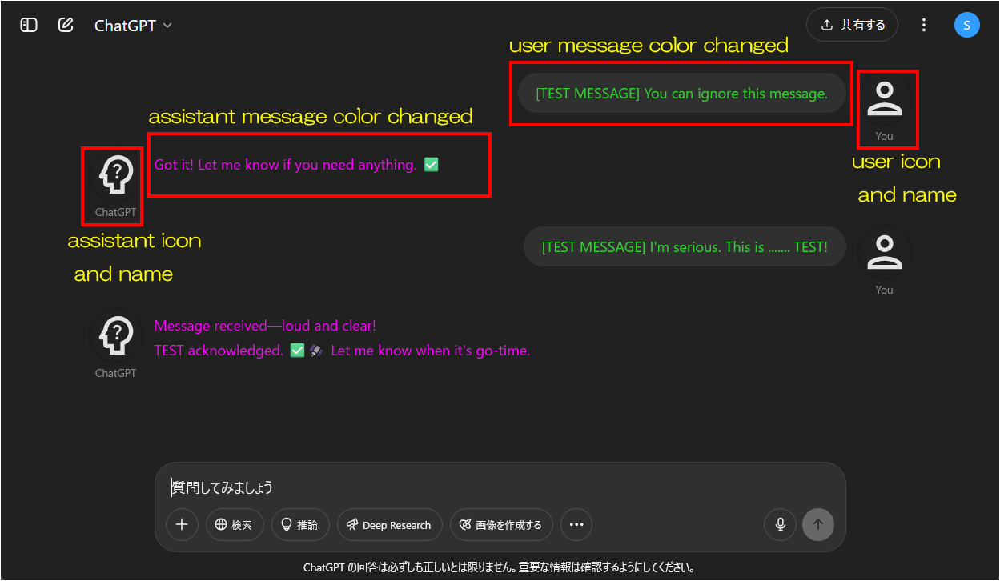
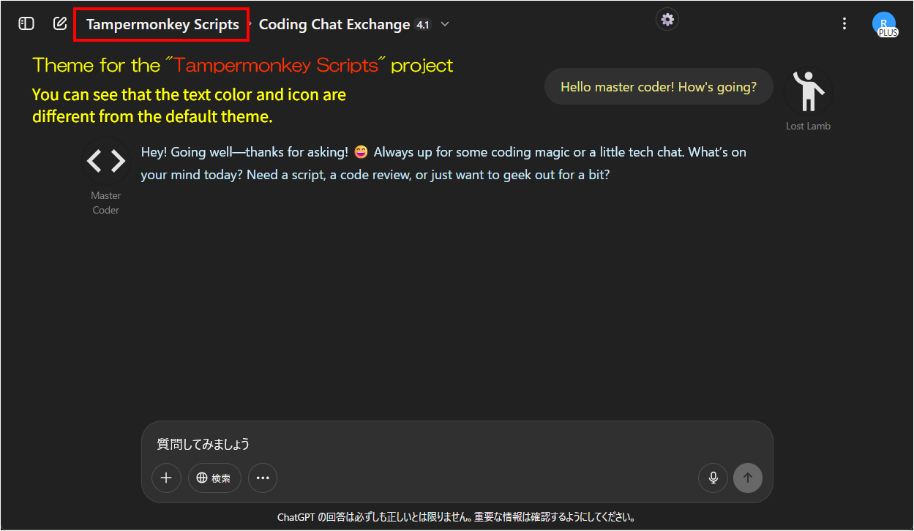
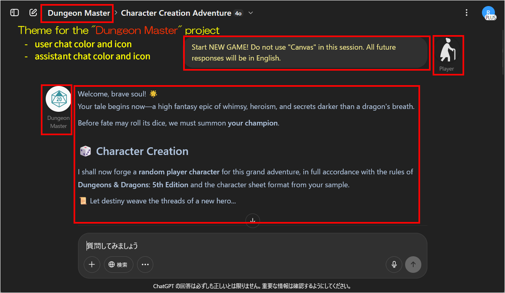
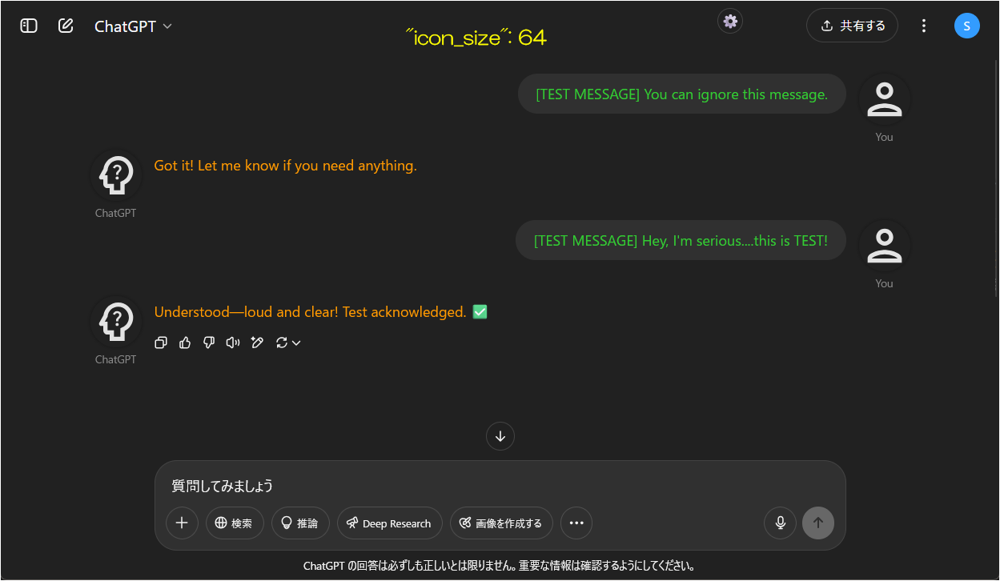
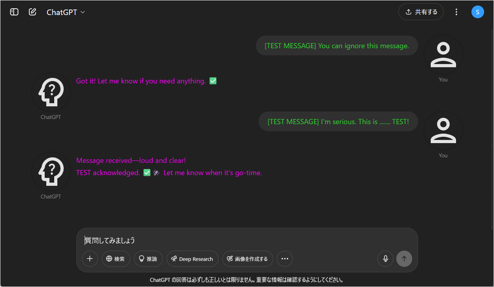
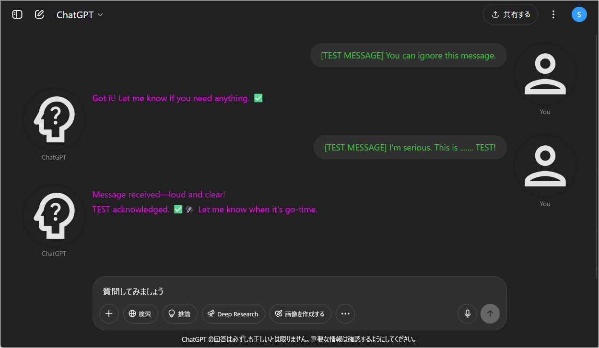

# ChatGPT Project Theme Automator

[日本語READMEはこちら (Japanese README is here)](./README_ja.md)

---

## Overview

**ChatGPT Project Theme Automator** is a Tampermonkey userscript that adds "automatic project-based theme switching" to the ChatGPT UI (chatgpt.com).  
You can freely customize user name, assistant name, text color, icon images, etc. for each project.

Although this script refers to "per project," in reality it checks not only the project name but also the page title, so **it can match and apply themes for Custom GPTs as well**.

The project feature in ChatGPT is available only to Plus users and above (as of May 2025), but since Free users can use Custom GPTs, the script will apply the default theme for regular chats and also allows you to apply themes to Custom GPTs.

---

## Features

* Apply a unique theme (colors, display names, icons, etc.) for each project (chat)
* Change display names, icons, and text colors for both user and assistant
* Switch themes by **exact project name match** or **regular expression**
* Auto-switch themes on page navigation, project name changes, or when starting a new chat
* Supports SVG/PNG/JPEG/Base64 images and external URLs for icons
* English and Japanese documentation included

---

## Screenshots

### 1. For free users or chats not linked to any project
The default theme defined in this script is applied.  


### 2. When opening a chat in a project named "Tampermonkey Scripts" (with a theme set for it)
The project-specific theme for "Tampermonkey Scripts" is applied (different icons/colors from default).  


### 3. When opening a chat in a project named "Dungeon Master" (with a theme set for it)
The project-specific theme for "Dungeon Master" is applied (distinct from default or other project themes).  


---

## Installation

1. Install the [Tampermonkey extension](https://www.tampermonkey.net/) in your browser.
2. Download the latest script from this repository:  
   [`ChatGPT Project Theme Automator.user.js`](./ChatGPT%20Project%20Theme%20Automator.user.js)
3. In Tampermonkey's dashboard, create a new script and paste the contents, or drag & drop the `.user.js` file.

---

## How to update

**Before updating, back up your theme settings (save them to a separate text file).**  
*Since the theme settings are embedded in the script, updating will overwrite them.*  
(Currently, external configuration is not planned—this script is mainly for personal use and quick theme switching for specific projects.)

1. Open the script in Tampermonkey's dashboard.
2. Replace the entire contents with the latest [`ChatGPT Project Theme Automator.user.js`](./ChatGPT%20Project%20Theme%20Automator.user.js).
3. Paste your backed-up theme settings into the configuration section.
4. Save the script (Ctrl+S).

---

## Usage

1. Edit the configuration section near the top of the script, inside `CHATGPT_PROJECT_THEME_CONFIG` (`themeSets` / `defaultSet`).  
   Define the project names and the themes (user name, icon, text color, etc.) you want to apply.

2. **Project names** can be specified as **exact strings** or **regular expressions**.  
   Regular expressions are recommended. Especially when trying to match Custom GPTs, note that comparison is done against the page title.  
   As of May 2025, the title format is **"{CustomGPTName} - {ChatName}"**, so it’s recommended to specify patterns as shown below.

   Example 1 (exact match):

   ```js
   projects: ['MyProject', 'Project Alpha']
   ```

   Example 2 (regular expressions):

   ```js
   // For meticulous users
   projects: [/^CustomGPTName - .*$/]
   // For typical users
   projects: [/^CustomGPTName.*$/]
   // For easygoing users
   projects: [/CustomGPTName/]
   ```

3. **User/assistant names** can be any string.
   If the name is too long, it will automatically wrap.

4. **Icons** can be specified as:

   * Image file URLs (e.g. [https://...](https://...))
   * Embedded base64 image data (useful for local/private icons)
   * SVG code (e.g. icons from [Google Fonts](https://fonts.google.com/icons))

5. **Text color (`textcolor`)** can be set using a CSS color code (e.g. `#b0c4de`).
   If omitted, the original color is retained.

6. **Icon size** can be adjusted by changing `ICON_SIZE` in the config section. Recommended values:

   * 64 ... Default size (recommended)
   * 96 ... Use if you want larger character icons
   * 128 ... Larger than this may be too intrusive

7. All theme properties are optional. You only need to set the properties you want to override (`name`, `icon`, `textcolor`).
   Any omitted properties will inherit the default theme's value.

---

## Icon Size Examples

### ICON\_SIZE = 64

```js
const ICON_SIZE = 64;
```



### ICON\_SIZE = 96

```js
const ICON_SIZE = 96;
```



### ICON\_SIZE = 128

```js
const ICON_SIZE = 128;
```



---

## Example Configuration

Icons below use SVGs from [Google Fonts](https://fonts.google.com/icons).

```js
const CHATGPT_PROJECT_THEME_CONFIG = {
    themeSets: [
        {
            // Theme for 'project1'
            projects: ['project1'],
            // If nothing is specified for user, name/icon/textcolor are inherited from defaultSet.
            user: {
            },
            // If only textcolor is set for assistant, name/icon are inherited from defaultSet.
            assistant: {
                textcolor: '#FF9900'
            }
        },
        {
            // Theme for 'project2'
            projects: ['project2'],
            // To set all of name, icon, textcolor for user:
            user: {
                name: 'User',
                icon: '<svg xmlns="http://www.w3.org/2000/svg" height="24px" viewBox="0 0 24 24" width="24px" fill="#e3e3e3"><path d="M0 0h24v24H0V0z" fill="none"/><circle cx="15.5" cy="9.5" r="1.5"/><circle cx="8.5" cy="9.5" r="1.5"/><path d="M12 16c-1.48 0-2.75-.81-3.45-2H6.88c.8 2.05 2.79 3.5 5.12 3.5s4.32-1.45 5.12-3.5h-1.67c-.7 1.19-1.97 2-3.45 2zm-.01-14C6.47 2 2 6.48 2 12s4.47 10 9.99 10C17.52 22 22 17.52 22 12S17.52 2 11.99 2zM12 20c-4.42 0-8-3.58-8-8s3.58-8 8-8 8 3.58 8 8-3.58 8-8 8z"/></svg>',
                textcolor: '#f0e68c'
            },
            // To set only name and icon for assistant, textcolor is inherited from defaultSet.
            assistant: {
                name: 'CPU',
                icon: '<svg xmlns="http://www.w3.org/2000/svg" height="24px" viewBox="0 0 24 24" width="24px" fill="#e3e3e3"><path d="M0 0h24v24H0V0z" fill="none"/><circle cx="15.5" cy="9.5" r="1.5"/><circle cx="8.5" cy="9.5" r="1.5"/><path d="M12 14c-2.33 0-4.32 1.45-5.12 3.5h1.67c.69-1.19 1.97-2 3.45-2s2.75.81 3.45 2h1.67c-.8-2.05-2.79-3.5-5.12-3.5zm-.01-12C6.47 2 2 6.48 2 12s4.47 10 9.99 10C17.52 22 22 17.52 22 12S17.52 2 11.99 2zM12 20c-4.42 0-8-3.58-8-8s3.58-8 8-8 8 3.58 8 8-3.58 8-8 8z"/></svg>'
            }
        }
    ],
    defaultSet: {
        // If only name and icon are specified, text color is not changed (same as original ChatGPT)
        user: {
            name: 'You',
            icon: '<svg xmlns="http://www.w3.org/2000/svg" height="24px" viewBox="0 0 24 24" width="24px" fill="#e3e3e3"><path d="M0 0h24v24H0V0z" fill="none"/><path d="M12 6c1.1 0 2 .9 2 2s-.9 2-2 2-2-.9-2-2 .9-2 2-2m0 10c2.7 0 5.8 1.29 6 2H6c.23-.72 3.31-2 6-2m0-12C9.79 4 8 5.79 8 8s1.79 4 4 4 4-1.79 4-4-1.79-4-4-4zm0 10c-2.67 0-8 1.34-8 4v2h16v-2c0-2.66-5.33-4-8-4z"/></svg>'
        },
        assistant: {
            name: 'ChatGPT',
            icon: '<svg xmlns="http://www.w3.org/2000/svg" enable-background="new 0 0 24 24" height="24px" viewBox="0 0 24 24" width="24px" fill="#e3e3e3"><g><rect fill="none" height="24" width="24"/></g><g><g><path d="M19.94,9.06C19.5,5.73,16.57,3,13,3C9.47,3,6.57,5.61,6.08,9l-1.93,3.48C3.74,13.14,4.22,14,5,14h1l0,2c0,1.1,0.9,2,2,2h1 v3h7l0-4.68C18.62,15.07,20.35,12.24,19.94,9.06z M14.89,14.63L14,15.05V19h-3v-3H8v-4H6.7l1.33-2.33C8.21,7.06,10.35,5,13,5 c2.76,0,5,2.24,5,5C18,12.09,16.71,13.88,14.89,14.63z"/><path d="M12.5,12.54c-0.41,0-0.74,0.31-0.74,0.73c0,0.41,0.33,0.74,0.74,0.74c0.42,0,0.73-0.33,0.73-0.74 C13.23,12.85,12.92,12.54,12.5,12.54z"/><path d="M12.5,7c-1.03,0-1.74,0.67-2,1.45l0.96,0.4c0.13-0.39,0.43-0.86,1.05-0.86c0.95,0,1.13,0.89,0.8,1.36 c-0.32,0.45-0.86,0.75-1.14,1.26c-0.23,0.4-0.18,0.87-0.18,1.16h1.06c0-0.55,0.04-0.65,0.13-0.82c0.23-0.42,0.65-0.62,1.09-1.27 c0.4-0.59,0.25-1.38-0.01-1.8C13.95,7.39,13.36,7,12.5,7z"/></g></g></svg>'
        }
    }
};
```

---

## Notes & Limitations

* **There is no auto-update function.**
  When a new version is released, update the script manually.
* **Theme settings are embedded in the script.**
  Before updating, back up your configuration.
* Major UI changes to ChatGPT may break compatibility.

---

## License

MIT License

---

## Author

* [p65536](https://github.com/p65536)

---
