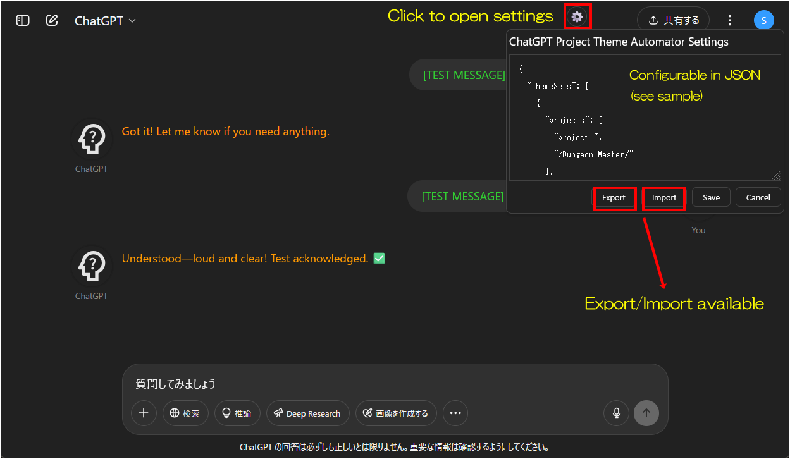
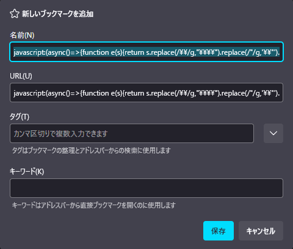
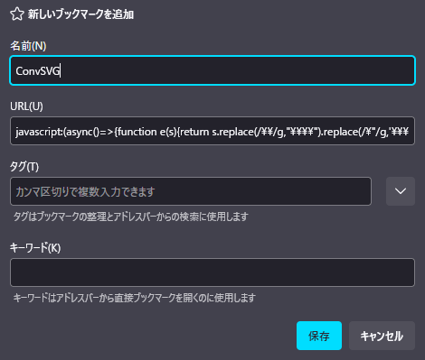
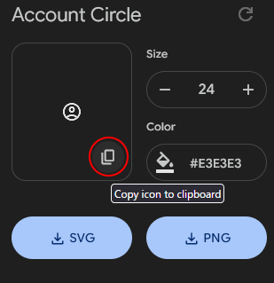
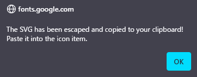

# ChatGPT Project Theme Automator


[](https://github.com/p65536/ChatGPT-Project-Theme-Automator/raw/main/ChatGPT%20Project%20Theme%20Automator.user.js)

[日本語READMEはこちら](./README_ja.md)

---

## Overview

**ChatGPT Project Theme Automator** is a Tampermonkey userscript that adds **automatic per-project theme switching** to the ChatGPT UI.  
You can freely customize user name, assistant name, text color, icon image, and more for each project.

Although “per project” is the core, the script actually checks both project names and page titles—so it **can apply custom themes for Custom GPTs as well**.

The project feature is available for Plus users (as of May 2025), but since Free users can use Custom GPTs, the script applies the default theme for regular chats and also allows you to theme Custom GPTs.

---

## Features

* Apply a unique theme (color, display name, icon, etc.) for each project or chat
* Change display names, icons, and text color for both user and assistant
* Theme switching supports **exact project name** or **regular expression**
* Automatically switches themes on page navigation, project name change, or new chat creation
* Icon field accepts SVG/PNG/JPEG/Base64 images or external URLs
* Settings can be exported/imported
* Documentation provided in English and Japanese

---

## Screenshots

### 1. Free users or chats not linked to any project
The script's default theme is applied.  


### 2. When you open a chat in the project “Tampermonkey Scripts”
The theme for "Tampermonkey Scripts" is applied. You can see icons and colors are different from the default.  


### 3. When you open a chat in the project “Dungeon Master”
A unique theme for "Dungeon Master" is applied.  


### 4. Settings screen
Click the gear icon (top right) to open the settings modal. You can edit themes as JSON, and export/import your configuration.


---

## Installation

1. Install the [Tampermonkey extension](https://www.tampermonkey.net/) in your browser.
2. Download the latest script:  
   [`ChatGPT Project Theme Automator.user.js`](./ChatGPT%20Project%20Theme%20Automator.user.js)
3. In the Tampermonkey dashboard, create a new script and paste the contents,  
   or drag & drop the `.user.js` file.

---

## How to update

**Before updating, export your current settings to avoid data loss.**

1. Open the script in Tampermonkey's dashboard.
2. Replace the script with the latest [`ChatGPT Project Theme Automator.user.js`](./ChatGPT%20Project%20Theme%20Automator.user.js).

---

## Usage

Open the settings modal and configure themes for each project (and a default theme) in JSON format.  
Direct editing in the modal works, but it's easier to edit in your favorite editor and paste in the result.  
See the next section for JSON format details.

---

## Configuration Format

```json
{
  "themeSets": [
    {
      "projects": ["project1", "project2"],
      "user": { "name": "user name", "textcolor": "#ffefd5", "icon": "(see sample)" },
      "assistant": { "name": "assistant name", "textcolor": "#1e90ff", "icon": "(see sample)" }
    },
    {
      "projects": ["project3", "/Dungeon Master/"],
      "user": { "name": "Player", "textcolor": "#ffefd5", "icon": "(see sample)" },
      "assistant": { "name": "Dungeon Master", "textcolor": "#1e90ff", "icon": "(see sample)" }
    }
  ],
  "defaultSet": {
    "user": { "name": "You", "textcolor": "#32cd32", "icon": "(see sample)" },
    "assistant": { "name": "ChatGPT", "textcolor": "#ff9900", "icon": "(see sample)" }
  }
}
````

**Explanation:**

1. ### `themeSets`

   Each `{ ... }` block defines a theme, which can be applied to multiple projects.
   You can add as many themes as you like.

   * `projects`:  
     Specify project names (as strings) or **regular expressions** (as strings).
     If using a regular expression, enclose it in quotes, like `"/project1/"`.
     This is required for JSON to treat regexes as strings.
     Regular expressions are generally recommended, as chat titles may change or not include project/GPT names in all situations.
     For example:

     * **{CustomGPTName} - {ChatName}**
     * **ChatGPT - {CustomGPTName}**
     * **ChatGPT**

     So, use a pattern like `"/^.*CustomGPTName.*$/"` or `"/CustomGPTName/"` to match widely.

   * `user` / `assistant`  
     Both support the following properties (all optional):

     | Property    | Description                                                                                                                                                                                                                                                                                       |
     | ----------- | ------------------------------------------------------------------------------------------------------------------------------------------------------------------------------------------------------------------------------------------------------------------------------------------------- |
     | `name`      | Display name                                                                                                                                                                                                                                                                                      |
     | `textcolor` | Text color (CSS color, e.g. `#b0c4de`)                                                                                                                                                                                                                                                            |
     | `icon`      | Icon: supports URL (e.g. `https://...`), Base64 image, or **SVG code** (such as from [Google Fonts](https://fonts.google.com/icons)).<br>**If you use SVG code, double quotes must be escaped as `\"`!**<br>To make this easier, see the [SVG Escape Bookmarklet](#svg-escape-bookmarklet) below. |

   Omitted properties inherit from the `defaultSet`.

2. ### `defaultSet`

   The fallback theme, used when no other theme matches.
   `user` and `assistant` can each specify `name`, `textcolor`, and `icon`.

---

## SVG Escape Bookmarklet

If you want to use raw SVG code for the `"icon"` field, you need to escape double quotes (`"`) as `\"`.
To simplify this, use the following **bookmarklet**:

### 1. Select all of the text below (triple click) and **drag and drop** it to your bookmarks bar:

```js
javascript:(async()=>{function e(s){return s.replace(/\\/g,"\\\\").replace(/\"/g,'\\\"').replace(/\n/g,"");}try{const t=await navigator.clipboard.readText();if(!t.trim().startsWith("<svg")){alert("Clipboard does not contain SVG code.");return;}const a=e(t);await navigator.clipboard.writeText(a);alert("The SVG has been escaped and copied to your clipboard! Paste it into the icon item.");}catch(r){alert("Failed: "+r.message);}})()
```

### 2. When prompted, give the bookmarklet any name you like (e.g., "ConvSVG").

(Example dialogs are shown below for Firefox.)





### 3. Usage

1. Copy the SVG code you want to use (e.g., from [Google Fonts](https://fonts.google.com/icons)).

   

2. Click the “ConvSVG” bookmarklet.

   

3. The escaped SVG code is now in your clipboard.

   

4. Paste it into the `"icon"` property in your JSON configuration:

   ```json
   "icon": "Paste here"
   ```

---

## Example Configuration

Ready-to-use sample configurations are available in the [`samples`](./samples) folder.
Icons in the sample use [Google Fonts](https://fonts.google.com/icons) SVGs.

---

## Icon Size

You can adjust the icon size by changing `ICON_SIZE` in the script.

```js
const ICON_SIZE = 64;
```

* 64 ... Default size (recommended)
* 96 ... For larger character icons
* 128 ... Larger than this may be distracting

### ICON\_SIZE = 64


### ICON\_SIZE = 96


### ICON\_SIZE = 128


---

## Notes & Limitations

* **No auto-update.**
  Please manually replace the script when a new version is released.
* Major UI changes on ChatGPT.com may break compatibility.

---

## License

MIT License

---

## Author

* [p65536](https://github.com/p65536)
