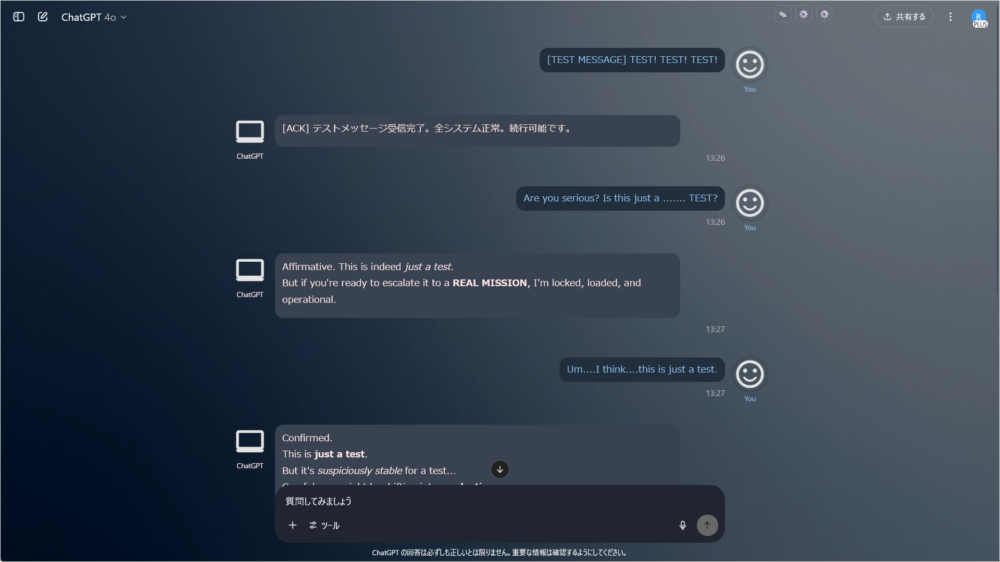
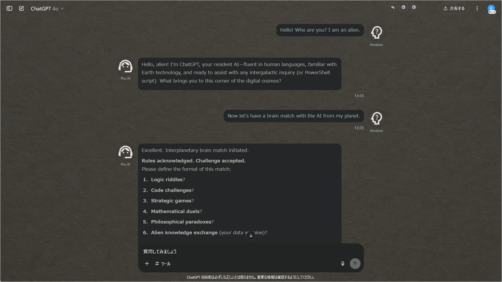
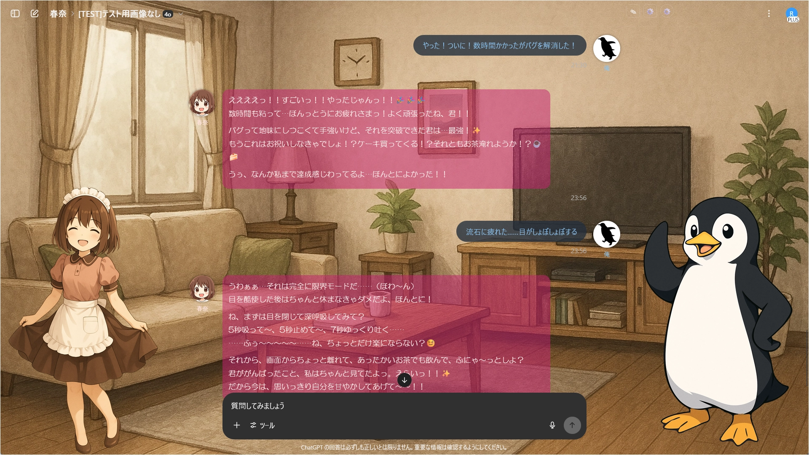
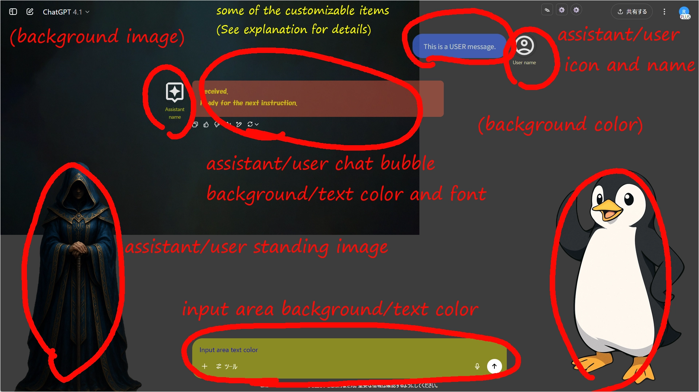
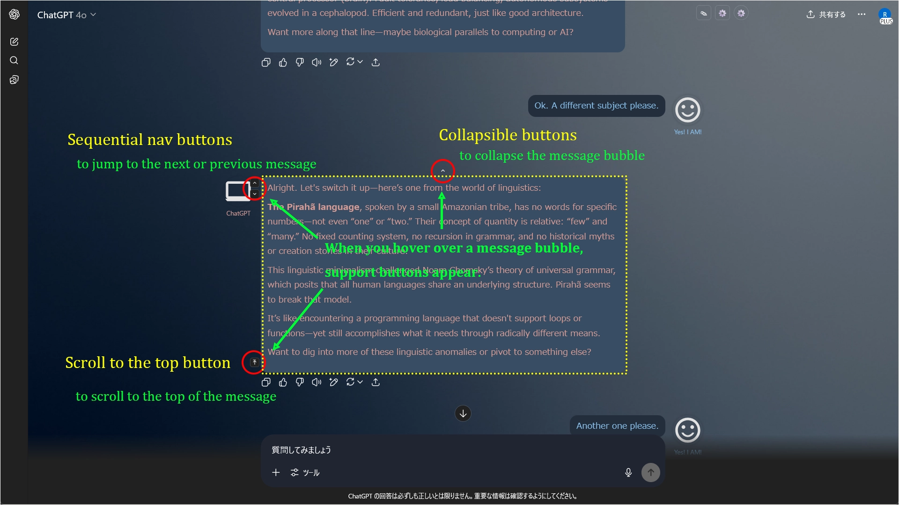

# ChatGPT Project Theme Automator

  
Last updated: **2025/07/02**  
[View changelog](./CHANGELOG.md)

[日本語のREADMEはこちら](./README_ja.md)

---

> **[IMPORTANT] As of v1.2.0, the structure of the configuration JSON has changed.** Old configuration files are not compatible. Please refer to the **[`Configuration JSON: Full Item Reference`](./docs/manual_json.md)** for details. A migration tool is also available.

---

## Overview

**ChatGPT Project Theme Automator** is a Tampermonkey userscript that adds a powerful theme function to the ChatGPT UI.

It allows you to flexibly customize the **user/assistant names, text colors, icons, bubble styles, background images, and standing images** for each project or chat. It also includes convenient UI enhancements such as **collapsible messages** and **navigation features**.

* Themes can be applied not only to project names but also to **custom GPT names and chat titles**, making it usable for free users as well.
* **Settings can be intuitively edited via a GUI.**
* It also supports importing and exporting settings in JSON format.

> ### Related Script
>
> **[ChatGPT Quick Text Buttons](https://github.com/p65536/ChatGPT-Quick-Text-Buttons)**  
> A userscript that adds "quick text insertion buttons" to the ChatGPT chat screen.

---

## Key Features

* **Intuitive theme editing via GUI**
* Automatically switch themes (color schemes, names, icons, backgrounds, etc.) for specified projects/custom GPTs/chat titles
* **Display "standing images"** for both user and assistant separately on the left and right sides
* **Collapsible messages** (to keep long messages compact)
* **Navigation between messages** (next/previous/top)
* Set a maximum width for the entire chat content
* Flexibly specify theme application targets by name or **regular expressions**
* Customize display names, icons, and text colors for user and assistant
* Specify user/assistant icons using SVG, PNG, JPEG, Base64 data, external URLs, etc.
* Export/import settings (in JSON format)
* Sample settings are provided, making it easy to get started.

---

## Screenshots

### 1. Example of a default theme applied when no specific project theme matches.

### 2. You can create as many themes as you want for specific project/custom GPT/chat names.

### 3. Another theme example.

### 4. You can even do this by using standing images and icons.

### 5. Conversations with your personal assistant become more engaging. (The image below is the author's personal assistant)

### 6. Example of customizable items (see [`Reference`](./docs/manual_json.md) for details)

### 7. UI Enhancement Features (Collapsible Messages / Message Navigation / Scroll to Top)

---

## Installation

1.  Install [Tampermonkey](https://www.tampermonkey.net/) in your browser.
2.  Download the latest version of
    [`ChatGPT Project Theme Automator.user.js`](./ChatGPT%20Project%20Theme%20Automator.user.js) from this repository.
3.  Open the Tampermonkey dashboard, create a new script, and paste the content, or drag and drop the `.user.js` file onto Tampermonkey.

---

## How to Update

1.  **Export your settings** as a backup, just in case.
2.  Open the script in the Tampermonkey dashboard and **replace the entire content** with the latest version, then save.

---

## How to Use

* Click the **gear icon** in the upper right corner to open the settings panel.
* From the settings panel, you can change various options or open the **Theme Editor (GUI) to create and edit themes**.
* If needed, use the "JSON" button to export your current settings or import sample settings.

---

## Sample Settings

The easiest way to get started is to copy a sample from the [`samples`](./samples) folder and modify its properties.  
Import the sample JSON using one of the following methods. The samples use public SVG icons from [Google Fonts](https://fonts.google.com/icons).

* Copy the full text of a sample JSON, paste it into the text area of the JSON settings modal, and click `Save`.
* Download a sample JSON file, and use the `Import` button in the JSON settings modal, then `Save`.

After applying the settings, the `defaultSet` configuration from the JSON should be applied.  
Next, to check the theme application for a specific project/custom GPT/chat, try the following:

* Start a chat name with `[Theme1]` -> The theme for `[Theme1]` will be applied.
* Start a chat name with `[Theme2]` -> The theme for `[Theme2]` will be applied.
* Start a chat name with `[Game]` -> The theme for `[Game]` will be applied.

The samples include one default theme and three specific themes.  
Try modifying these settings to your liking. Using the GUI theme editor is an easy way to make changes.  
For JSON format and setting details, please refer to the **[`ChatGPT Project Theme Automator Configuration JSON: Full Item Reference`](./docs/manual_json.md)**.

---

## Recommended Usage & Customization

  * Enhance the feeling of a personal assistant by setting custom icons and names.
  * Visually distinguish what you are working on by changing text colors and icons for each project.
  * Set up character profiles for multiple work projects or TRPG sessions.
  * Express your personality with custom icons or SVGs from Google Fonts.
  * Flexibly extend font and color themes with additional CSS.
  * Use regular expressions to flexibly match theme application targets.

## Notes & Limitations

  * The script itself does not have an auto-update feature. However, it is also available on [Greasy Fork](https://greasyfork.org/en/scripts/537656-chatgpt-project-theme-automator).  
    If you want to auto-update the script, please install it from Greasy Fork.  
    If you prefer manual updates, please replace the script manually.
  * If the ChatGPT UI undergoes major changes, the script may stop working.
  * It has been tested on Firefox. It will probably work on Chrome-based browsers, but it is unverified.

---

## License

MIT License

---

## Author

  * [p65536](https://github.com/p65536)

---

## Future Plans

### High Priority (Items the author wants to implement)

  * Allow user/assistant names to be displayed without wrapping under the icon.
  * Add a mask for the background of user/assistant names (they are currently transparent, which can make them hard to read depending on the background).
  * Adjust theme application on the project selection screen (currently does not fully consider themes for chat lists, project files, etc.).
  
### Low Priority (Items under consideration but not deemed necessary at present)

  * Auto-update for the script (use [Greasy Fork](https://greasyfork.org/en/scripts/537656-chatgpt-project-theme-automator) for auto-updates).
  * Cloud-based settings synchronization (local management via export/import is sufficient).
  * Theme application to the sidebar.
  * Font changes for the input area.
  * On/off switch for theme application to the toolbar area (the top area with project name, chat title, account icon, etc.).
