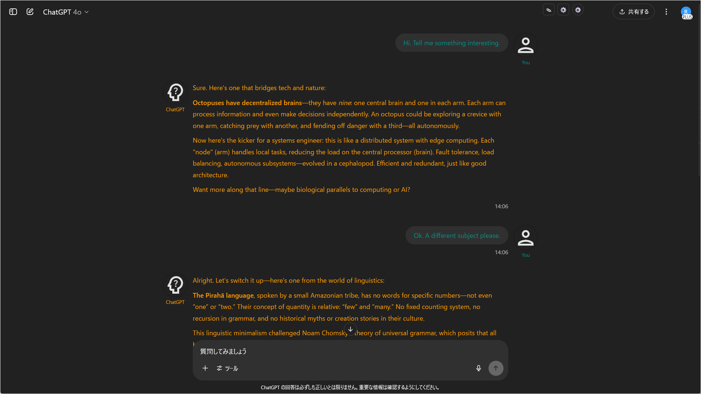
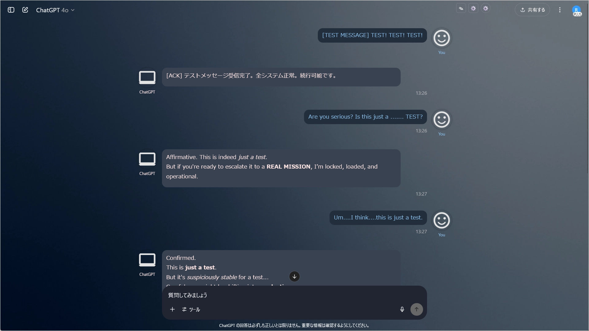
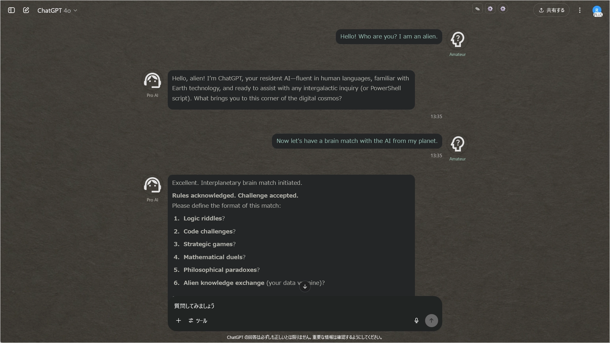
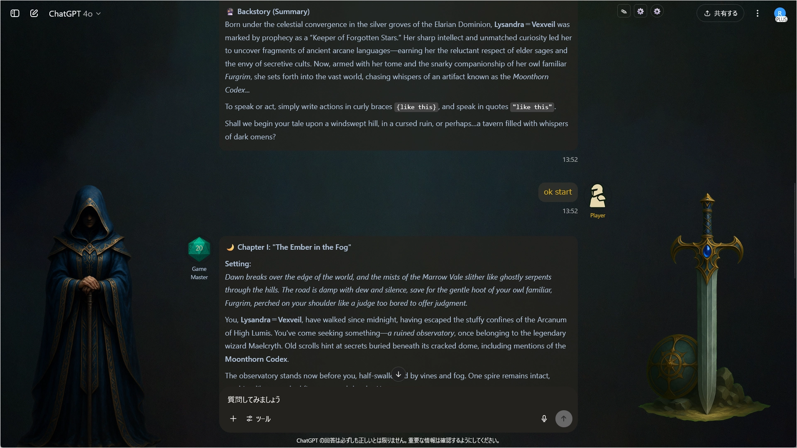
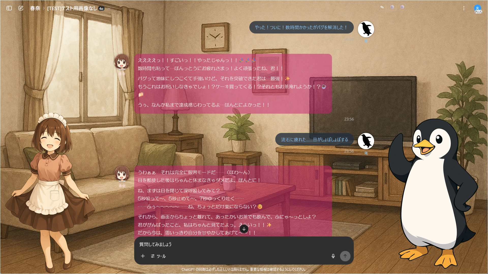
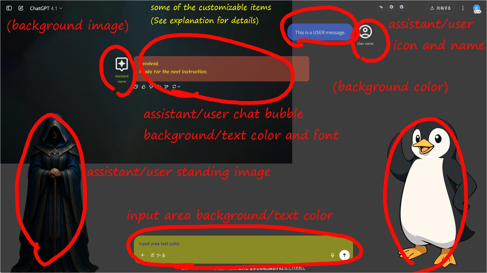
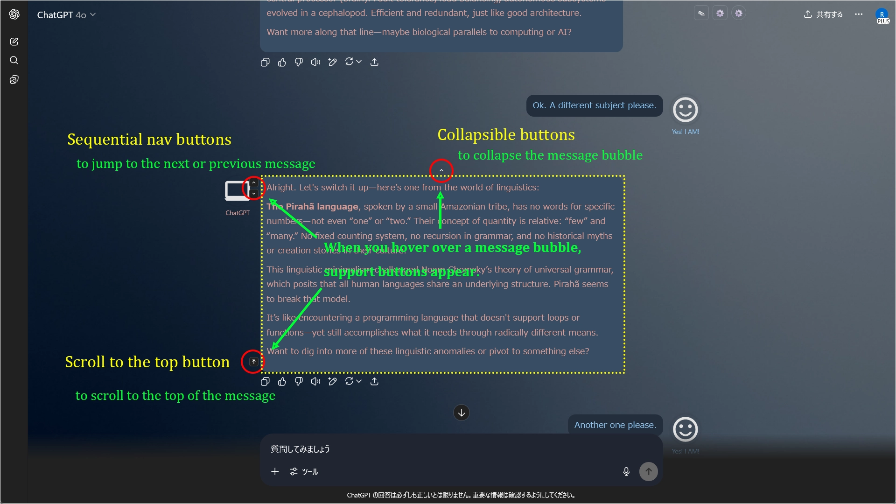

# ChatGPT Project Theme Automator

  
最終更新日: **2025/07/02**  
[変更履歴はこちら](./CHANGELOG_ja.md)

[English README is here.](./README.md)

---

> **【重要】v1.2.0より、設定JSONの構造が変更されました。** 古い形式の設定ファイルは互換性がありませんのでご注意ください。詳細は **[`設定JSON：全項目解説`](./docs/manual_json_ja.md)** を参照してください。移行ツールも用意してあります。

---

## 概要

**ChatGPT Project Theme Automator**は、ChatGPTのUIに強力なテーマ機能を追加するTampermonkeyユーザースクリプトです。

プロジェクトやチャットごとに、**ユーザー名／アシスタント名・文字色・アイコン画像・吹き出しスタイル・背景画像・スタンディング画像**などを柔軟にカスタマイズできます。さらに、**メッセージの折りたたみ**や**ナビゲーション**などの便利なUI改善機能も搭載しています。

* テーマ適用先はプロジェクト名だけではなく、**カスタムGPT名やチャット名**にもマッチします。そのため**フリーユーザーでも利用できます。**
* **設定はGUIで直感的に編集可能。**
* JSONでのインポート／エクスポートにも対応しています。

> ### 関連スクリプト
>
> **[ChatGPT Quick Text Buttons](https://github.com/p65536/ChatGPT-Quick-Text-Buttons)**  
ChatGPTのチャット画面に「定型文クイック挿入ボタン」を追加するユーザースクリプトです。

---

## 主な機能

* **GUIによる直感的なテーマ編集機能**
* 指定のプロジェクト/カスタムGPT/チャット名ごとにテーマ（配色、名前、アイコン、背景など）を自動切替
* ユーザー／アシスタントそれぞれの **「立ち絵（スタンディングイメージ）」を左右に別々に表示可能**
* **メッセージの折りたたみ機能**（長文をコンパクトに表示）
* **メッセージ間のナビゲーション機能**（次/前/先頭へジャンプ）
* チャット全体の最大幅を指定可能
* テーマ適用先を名前や**正規表現**で柔軟に指定
* ユーザー／アシスタントの表示名・アイコン・文字色をカスタマイズ可能
* ユーザー／アシスタントのアイコンをSVG・PNG・JPEG・Base64データ・外部URL等で指定可能
* 設定をエクスポート／インポート可能（JSON形式）
* 設定サンプルあり。すぐに使い始めることができます。

---

## 実行イメージ

### 1. テーマ適用例(特定のプロジェクトに紐付かない場合に適用されるデフォルトテーマを設定可能)

### 2. 特定のプロジェクト名/カスタムGPT名/チャット名に適用するテーマをいくつでも作成可能

### 3. 別のテーマ例

### 4. "立ち絵"やアイコンを活用すればこんなこともできる

### 5. パーソナルアシスタントとの会話も捗る(以下の画像は作者のパーソナルアシスタント)

### 6. カスタマイズ可能項目の例（詳細は[`説明`](./docs/manual_json_ja.md)参照）

### 7. UI改善機能（メッセージ折りたたみ／メッセージ間移動／メッセージ先頭に移動）

---

## インストール方法

1.  [Tampermonkey](https://www.tampermonkey.net/) をブラウザに導入
2.  本リポジトリの最新版
    [`ChatGPT Project Theme Automator.user.js`](./ChatGPT%20Project%20Theme%20Automator.user.js) をダウンロード
3.  Tampermonkeyの新規スクリプト作成で貼り付けて保存
    または `.user.js` ファイルをTampermonkeyへドラッグ＆ドロップ

---

## 更新方法

1.  念のため**設定をエクスポート**しておく
2.  Tampermonkeyのダッシュボードで本スクリプトを開き、最新版に**全文置換**して保存

---

## 使い方

* 画面右上の歯車アイコンから**設定画面を開く**
* 設定パネルから各種オプションを変更したり、**テーマエディタ(GUI)を開いてテーマを作成・編集**できます。
* 必要に応じて"JSON"ボタンで、現在の設定をエクスポートしたり、サンプル設定をインポートしたりしてください。

---

## サンプル設定

一番簡単な始め方は、[`samples`](./samples) フォルダのサンプルをコピーして、プロパティを書き換えてみることです。  
以下いずれかの方法でサンプルJSONを取り込んでください。なおサンプルでは [Google Fonts](https://fonts.google.com/icons) の公開SVGアイコンを利用しています。

* サンプルJSONのテキストを全文コピーして、JSON設定画面のテキストエリアに貼り付けて`Save`
* サンプルJSONをダウンロードして、JSON設定画面で`Import`して`Save`

設定適用後、JSON設定の`defaultSet`の設定が適用されるはずです。  
では次に特定のプロジェクト／カスタムGPT／チャットに対するテーマ適用を確認するために、以下を試してください。

* チャット名を`[Theme1]`で始まる名前にする->`[Theme1]`用のテーマが適用される
* チャット名を`[Theme2]`で始まる名前にする->`[Theme2]`用のテーマが適用される
* チャット名を`[Game]`で始まる名前にする->`[Game]`用のテーマが適用される

サンプルで用意しているテーマは default(1) + 特定テーマ(3) の4つです。  
まずはこれらの設定内容を好きな値に書き換えてみてください。GUI設定画面を使うと手軽に変更出来ます。  
JSON書式や設定項目については **[`ChatGPT Project Theme Automator 設定JSON：全項目解説`](./docs/manual_json_ja.md)** 参照。

---

## 推奨運用・カスタマイズ例

  * アイコンや名前を設定することで自分専用アシスタント感倍増
  * プロジェクトごとに文字色やアイコンが変わることで、現在何をしているか視覚的に分かりやすくなる
  * 複数業務プロジェクト・TRPGセッションごとにキャラクター設定
  * 自作アイコンやGoogle FontsのSVG利用による個性演出
  * フォント・配色テーマもCSS追加で柔軟拡張可能
  * テーマを適用先を正規表現で柔軟にマッチできる

## 注意事項・制限

  * スクリプト自体に自動アップデート機能はありませんが、[Greasy Fork](https://greasyfork.org/ja/scripts/537656-chatgpt-project-theme-automator) でもスクリプトを公開しています。  
    スクリプトを自動更新したい方は、 Greasy Fork からインストールしてください。  
    スクリプトを手動更新したい方は、手動でスクリプトを差し替えてください。
  * ChatGPT側のUIが大幅に変更された場合、動作しなくなる可能性があります。
  * Firefoxで動作確認しています。Chrome系ブラウザでも多分動きますが未検証です。

-----

## ライセンス

MIT License

-----

## 作者

  * [p65536](https://github.com/p65536)

-----

## 今後の予定

### 優先的に検討中の項目（作者が実装したいと考えている）

  * ユーザー名/アシスタント名をアイコンの下に折り返して表示しているが、折り返しなしで表示できるようにする。
  * ユーザー名/アシスタント名の背景にマスク設定（今は透過しているため、背景画像や背景色によっては名前が見えにくいことがある）
  * プロジェクト選択画面（サイドバーでプロジェクトを選択した直後の状態）でのテーマ適用調整（今はチャットリストやプロジェクトファイル等へのテーマ適用を考慮していない）
  
### 検討はしているが、現状では必要性を感じていない項目

  * スクリプトの自動更新（自動更新したい方は [Greasy Fork](https://greasyfork.org/ja/scripts/537656-chatgpt-project-theme-automator) からインストールしてください）
  * クラウド経由での設定同期（export/importによるローカル管理で十分）
  * サイドバーへのテーマ適用
  * 入力エリアのフォント変更
  * ツールバー（画面上部のプロジェクト名やチャット名、アカウントアイコン等が表示されるエリア）へのテーマ適用on/off切り替え（初めはツールバーを除外してテーマ適用していたのだが、思ったよりツールバーが目立つから今のように全面適用にした）
