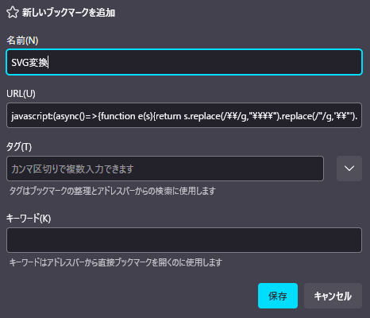
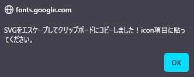

# ChatGPT Project Theme Automator


[](https://github.com/p65536/ChatGPT-Project-Theme-Automator/raw/main/ChatGPT%20Project%20Theme%20Automator.user.js)

[English README is here.](./README.md)

---

## 概要

ChatGPTのUIに「プロジェクト名ごとのテーマ自動切り替え」機能を追加するTampermonkeyユーザースクリプトです。  
各プロジェクトごとに、ユーザー名・アシスタント名・文字色・アイコン画像などを自由にカスタマイズできます。

「プロジェクトごと」と書きましたが、実際にはプロジェクト名のほかにページタイトルでもチェックしているため、**カスタムGPT名にもマッチします**。

ChatGPTのプロジェクト機能を使えるのはPlusユーザー以上（2025年5月現在）ですが、FreeユーザーでもカスタムGPTは使えるため、デフォルト設定のテーマを反映させることと、カスタムGPTへのテーマ適用はできます。

---

## 主な機能

* プロジェクトごとに独自のテーマ（配色・表示名・アイコンなど）を適用
* ユーザー／アシスタントの表示名・アイコン・文字色の変更
* テーマはプロジェクト名の**完全一致**または**正規表現**で切り替え可能
* テーマ自動切り替えはページ遷移・プロジェクト名変更・新チャット作成にも対応
* SVG/PNG/JPEG/Base64画像・外部URL等、様々な形式でアイコン指定が可能
* 設定をエクスポート／インポート可能
* 日本語・英語両対応のドキュメント

---

## 実行イメージ

### 1. フリーユーザーの場合や特定のプロジェクトに紐づかないチャットの場合
本スクリプトで設定したデフォルトのテーマが適用される


### 2. プロジェクト名「Tampermonkey Scripts」に対するテーマ設定をして同プロジェクトのチャットを開いた場合
プロジェクト「Tampermonkey Scripts」用のテーマが適用される（デフォルトのテーマとは異なるアイコン・色が使われているのが分かる）


### 3. プロジェクト名「Dungeon Master」に対するテーマ設定をして同プロジェクトのチャットを開いた場合
プロジェクト「Dungeon Master」用のテーマが適用される（デフォルトや他プロジェクトのテーマとは異なるアイコン・色が使われているのが分かる）


### 4. 設定画面
画面上部やや右にある歯車アイコンをクリックすると設定画面が開く。JSON形式で指定する。エクスポート／インポートもここで行える。


---

## インストール方法

1. [Tampermonkey 拡張](https://www.tampermonkey.net/) をお使いのブラウザにインストール
2. このリポジトリの最新版スクリプト
   [`ChatGPT Project Theme Automator.user.js`](./ChatGPT%20Project%20Theme%20Automator.user.js) をダウンロード
3. Tampermonkey のダッシュボードで「新規スクリプト作成」→ スクリプト内容を貼り付けて保存
   または `.user.js` ファイルを Tampermonkey にドラッグ＆ドロップ

---

## 更新方法

念のため、設定はエクスポートしておいてください。

1. Tampermonkey のダッシュボードから本スクリプトを開く
2. 最新版 [`ChatGPT Project Theme Automator.user.js`](./ChatGPT%20Project%20Theme%20Automator.user.js) の内容で全文置換

---

## 使い方

設定画面を開き、各プロジェクトに対するテーマ、およびデフォルトテーマをJSON形式で指定します。設定画面で直接編集するのは効率が悪いため、**任意のエディタで編集後にコードを貼り付ける**ことをお勧めします。JSONのフォーマットは次項参照。

## JSONのフォーマットについて
```json
{
    "themeSets": [
        {
            "projects": ["project1","project2"],
            "user": {"name": "user name", "textcolor": "#ffefd5", "icon": "(see sample)"},
            "assistant": {"name": "assistant name", "textcolor": "#1e90ff", "icon": "(see sample)"}
        },
        {
            "projects": ["project3","/Dungeon Master/"],
            "user": {"name": "Player", "textcolor": "#ffefd5", "icon": "(see sample)"},
            "assistant": {"name": "Dungeon Master", "textcolor": "#1e90ff", "icon": "(see sample)"}
        }
    ],
    "defaultSet": {
        "user": {"name": "You", "textcolor": "#32cd32", "icon": "(see sample)"},
        "assistant": {"name": "ChatGPT", "textcolor": "#ff9900", "icon": "(see sample)"}
    }
}
```

1. ### `themeSets`
    **`{ ... }`** で囲まれた範囲が一つのテーマです。一つのテーマを複数のプロジェクトに対して適用できます。    
    テーマは好きなだけ増やせます。

    * `projects`  
      該当テーマを適用するプロジェクト名をダブルクオーテーション`""`で囲んで、カンマ`,`区切りで列挙します。**完全一致の文字列**、または**正規表現**で指定できます。  
      **正規表現**で指定する際は、例のように`""`で囲ってください 。このように→`"/project1/"`。これはJSONでテキスト保存する際に文字列として扱う必要があるためです。  

      指定方法のおすすめは**正規表現**です。プロジェクトに属するチャットはプロジェクト名を取得できるのですが、カスタムGPTの場合はタイトルと比較することになります。  
      ところがチャットのタイトルは状況に応じて変わります。例えば以下のように。  
         * **{CustomGPTName} - {ChatName}**  
         * **ChatGPT - {CustomGPTName}**  
         * **ChatGPT**  

      またカスタムGPTで新規チャットを開始すると、タイトルにカスタムGPT名が含まれない状況もあり得ます。この場合はサイドバーから該当チャットの名前を変更すると後ろにカスタムGPT名が付くようになると思います。  
      このようにタイトルは不安定ですので、広くマッチするように正規表現で **`"/^.*CustomGPTName.*$/"`** または単に **`"/CustomGPTName/"`** と指定するとよいでしょう。  

    * `user` / `assistant`  
      どちらも以下のプロパティを使用します。**どの項目も省略可能**です。未指定時は `defaultSet` の設定が使用されます。

        | 項目 | 内容 |
        |----|----|
        | `name` | 名前を指定します。 |
        | `textcolor` | 文字色をCSSカラーコード（例：`#b0c4de`）で指定します。 |
        | `icon` | アイコンを指定します。**画像ファイルのURL**（[https://...）](https://...）)、**base64埋め込み画像データ**（自作アイコンをローカルのみで使いたい場合等）、**SVGコード**（例： [Google Fonts](https://fonts.google.com/icons) で公開されているアイコン）等を指定できます。<br>**SVGコードを指定する場合はダブルクオーテーションをエスケープする必要があります（" -> \\"）。** 設定をJSONでエクスポートする機能を付けたためにこのような仕様になりました。手で変換するのは面倒ですので、これを簡単に変換するためのツールを用意しました。次項 **[SVGエスケープ用ブックマークレット](#svgエスケープ用ブックマークレット)** を参照してください。 |

2. ### `defaultSet`
    **デフォルトのテーマ** を設定します。現在のチャットが"themeSets"で定義したプロジェクトにマッチしない場合、デフォルトのテーマが適用されます。  
    `user`, `assistant` それぞれにデフォルトの `name`, `textcolor`, `icon` を設定してください。  
    

3. テーマ設定の**各項目は省略可能**です。`name`,`icon`,`textcolor`のうち、必要な項目だけ設定してください。  
   各プロジェクトのテーマで設定を省略した項目は、**デフォルトのテーマ**の同項目が使われます。  
   なお`defaultSet`でも**各項目を省略できます**。その場合、ChatGPTのデフォルト設定が使用されます（つまり何も変わらない）。

---

## SVGエスケープ用ブックマークレット

SVGコードの `"` を `\"` にエスケープするための**ブックマークレット**です。  
ブックマークレットとは、ブックマークにJavaScriptのコードを登録し、そのコードを簡単に実行できるようにする機能です。  
以下の手順でブックマークに追加してください。

### 1. 以下のテキストを全て選択（トリプルクリック）して**ブックマークバーにドラッグ＆ドロップ**してください。

```js
javascript:(async()=>{function e(s){return s.replace(/\\/g,"\\\\").replace(/"/g,'\\"').replace(/\n/g,"");}try{const t=await navigator.clipboard.readText();if(!t.trim().startsWith("<svg")){alert("クリップボードにSVGコードがありません。");return;}const a=e(t);await navigator.clipboard.writeText(a);alert("SVGをエスケープしてクリップボードにコピーしました！icon項目に貼ってください。");}catch(r){alert("失敗: "+r.message);}})()
```

### 2. ブックマーク追加のダイアログが表示されます。**任意の名前**を付けて保存してください。例：`SVGコード変換`  

  #### ブックマーク登録画面（画像はFirefoxの場合）

  

  #### 任意の名前を付けて保存（画像はFirefoxの場合）

  

  #### ブックマークに登録された（画像はFirefoxの場合）

  

### 3. 使い方

 1. SVGを公開しているサイト（ここでは [Google Fonts](https://fonts.google.com/icons) を例にします）で任意のアイコンのSVGコードをコピー。

    

 2. 先に作成したブックマークレット **`SVGコード変換`** を実行（ブックマークをクリック）

    

 3. 変換後のSVGコードがクリップボードにコピーされる。

    

 4. クリップボードのテキストを設定ファイル(JSON)の `icon` 項目の `""`内に貼り付ける。

     ```json
     "icon": "ここに貼り付け"
     ```
 
---

## サンプル設定

**コピー＆貼り付けで使えるサンプル**は [`samples`](./samples) フォルダ参照。  
なおサンプルで使用しているアイコンは [Google Fonts](https://fonts.google.com/icons) で公開されているアイコンを使用しています。

## アイコンサイズ

スクリプトを直接更新することで**アイコンサイズ**を変更できます。

```js
const ICON_SIZE = 64;
```

   * 64 ... **デフォルトサイズ**。おすすめ。
   * 96 ... キャラクターアイコンを大きく見せたい場合にはありかも。
   * 128 ... これより大きいと邪魔になりそう。

## アイコンサイズのイメージ感

### ICON_SIZE = 64;
```js
const ICON_SIZE = 64;
```


### ICON_SIZE = 96;
```js
const ICON_SIZE = 96;
```


### ICON_SIZE = 128;
```js
const ICON_SIZE = 128;
```


---

## 注意事項・制限

* **自動アップデート機能はありません。**
  新バージョンが公開された際は、手動でスクリプトを差し替えてください。
* ChatGPT側のUIが大幅に変更された場合、動作しなくなる可能性があります。

---

## ライセンス

MIT License

---

## 作者

* [p65536](https://github.com/p65536)

---
