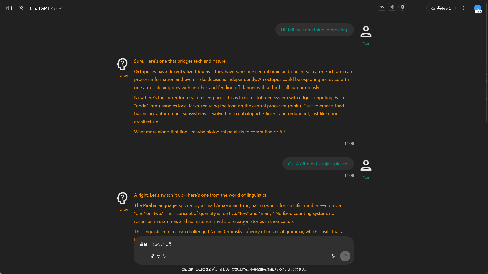
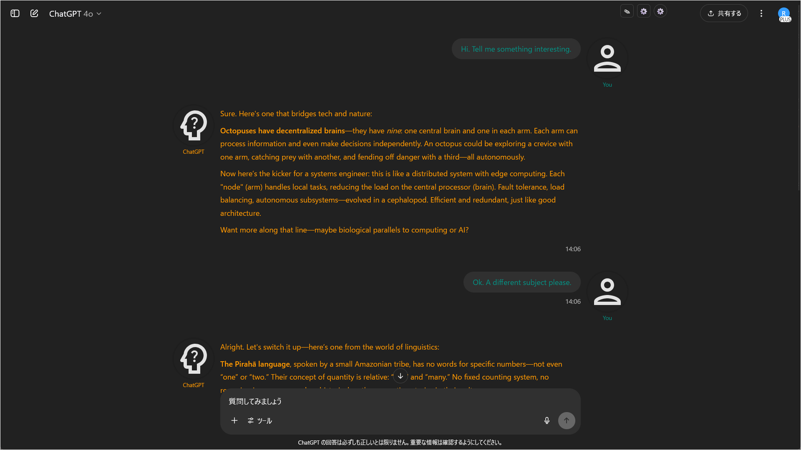
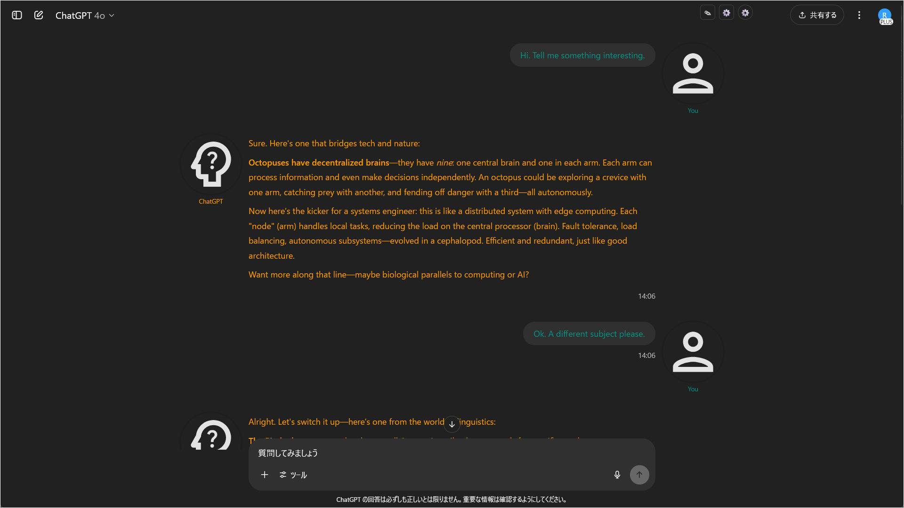
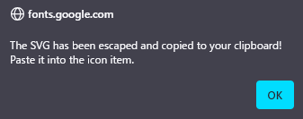

# ChatGPT Project Theme Automator Configuration JSON: Full Item Reference

## Overview

**[IMPORTANT] As of v1.2.0, the structure of the configuration has changed significantly.**
* Property names have been unified to **camelCase**, like `"bubbleBackgroundColor"`.
* `"projects"` has been changed to `"matchPatterns"` within the `"metadata"` object.
* New `"features"` and `"options"` have been added for UI improvements and chat width settings.
* Background and input area settings are now grouped under `"window"` and `"inputArea"` objects.

**Old configuration files are not compatible. Please use the following tool to migrate your settings file.**  
[Configuration File Converter](https://p65536.github.io/ChatGPT-Project-Theme-Automator/tools/convert_json.html)

---

This document provides a table summarizing the purpose, example usage, allowed values, and notes for each property.  
Refer to this page if you get stuck during customization.

**Note:** The property names used in this script's configuration are different from CSS property names. The corresponding CSS property names are listed in the remarks column, so please use the CSS property names when searching for specifications online.

---

## JSON Structure

The following is a sample to illustrate the JSON structure. **Ready-to-use samples for copy-pasting or importing** are available in the [`samples`](../samples) folder.

```json
{
  "options": {
    "icon_size": 64,
    "chat_content_max_width": "800px"
  },
  "features": {
    "collapsible_button": {
      "enabled": true,
      "display_threshold_multiplier": 2
    },
    "scroll_to_top_button": {
      "enabled": true,
      "display_threshold_multiplier": 2
    },
    "sequential_nav_buttons": {
      "enabled": true
    }
  },
  "themeSets": [
    {
      "metadata": {
        "id": "cpta-theme-example-1",
        "name": "My Project Theme 1",
        "matchPatterns": [
          "/\\[theme1\\]/i",
          "/My Project/i"
        ]
      },
      "user": {
        "name": "You",
        "icon": "url, SVG, base64, ...",
        "textColor": "#89c4f4",
        "font": "Meiryo, sans-serif",
        "bubbleBackgroundColor": "#232e3b",
        "bubblePadding": "10px 14px",
        "bubbleBorderRadius": "16px",
        "bubbleMaxWidth": "70%",
        "standingImageUrl": ""
      },
      "assistant": {
        "name": "Assistant",
        "icon": "url, SVG, base64, ...",
        "textColor": "#ffe4e1",
        "font": "Meiryo, sans-serif",
        "bubbleBackgroundColor": "#384251",
        "bubblePadding": "10px 14px",
        "bubbleBorderRadius": "16px",
        "bubbleMaxWidth": "90%",
        "standingImageUrl": ""
      },
      "window": {
        "backgroundColor": "#151b22",
        "backgroundImageUrl": "url('url here')",
        "backgroundSize": "cover",
        "backgroundPosition": "center center",
        "backgroundRepeat": "no-repeat",
        "backgroundAttachment": "scroll"
      },
      "inputArea": {
        "backgroundColor": "#202531",
        "textColor": "#e3e3e3",
        "placeholderColor": "#5e6b7d"
      }
    },
    {
      "metadata": {
        "id": "cpta-theme-example-2",
        "name": "(Theme name here)",
        "matchPatterns": [
          "(Regular expression here)"
        ]
      },
      "..." : "(You can add as many theme settings as you like)"
    }
  ],
  "defaultSet": {
    "user": {
      "name": "You",
      "icon": "",
      "textColor": null,
      "font": null,
      "bubbleBackgroundColor": null,
      "bubblePadding": null,
      "bubbleBorderRadius": null,
      "bubbleMaxWidth": null,
      "standingImageUrl": null
    },
    "assistant": {
      "name": "ChatGPT",
      "icon": "",
      "textColor": null,
      "font": null,
      "bubbleBackgroundColor": null,
      "bubblePadding": null,
      "bubbleBorderRadius": null,
      "bubbleMaxWidth": null,
      "standingImageUrl": null
    },
    "window": {
      "backgroundColor": null,
      "backgroundImageUrl": null,
      "backgroundSize": "cover",
      "backgroundPosition": "center center",
      "backgroundRepeat": "no-repeat",
      "backgroundAttachment": "fixed"
    },
    "inputArea": {
      "backgroundColor": null,
      "textColor": null,
      "placeholderColor": null
    }
  }
}
````

-----

## Overall Structure

| Item Name  | Description/Example                                                                                            |
| ---------- | -------------------------------------------------------------------------------------------------------------- |
| `options`  | Common settings for script behavior and display.                                                               |
| `features` | Settings to enable/disable UI improvement features.                                                            |
| `themeSets`  | An array of theme settings. You can create multiple themes.                                                    |
| `defaultSet` | The default theme settings. Applied when no theme in `themeSets` matches.                                      |

-----

## `"options"` Settings

| Property Name            | Description                             | Example                    | Notes/Allowed Values                                                                                    |
| ------------------------ | --------------------------------------- | -------------------------- | ------------------------------------------------------------------------------------------------------- |
| `icon_size`              | Icon size                               | `64`                       | Number. Default is `64`.<br>Values `64`, `96`, or `128` are recommended for balanced display.           |
| `chat_content_max_width` | Max width of the chat content area.     | `'800px'`<br>`'70vw'`       | A valid CSS `max-width` value as a string.<br>Blank or `null` for ChatGPT's default.                    |

### Display Image (`icon_size`)

| icon\_size Value | Description & Recommended Use | Example                                                |
|-----------|-------------------------------|--------------------------------------------------------|
| 64        | **Default size** / standard   |                |
| 96        | Larger icons                  |                |
| 128       | Extra-large (character art)   |              |

-----

## `"features"` Settings

Configure ON/OFF and thresholds for convenient UI improvement features.

| Property Name            | Description                                                                                     | Example                                                | Notes/Allowed Values                                                                                                                                                                                                                                                                                  |
| ------------------------ | ----------------------------------------------------------------------------------------------- | ------------------------------------------------------ | ----------------------------------------------------------------------------------------------------------------------------------------------------------------------------------------------------------------------------------------------------------------------------------------------------- |
| `collapsible_button`     | Settings for the button to collapse long messages.                                              | `{ "enabled": true, "display_threshold_multiplier": 2 }` | `enabled`: `true`/`false`<br>`display_threshold_multiplier`: Height threshold to show the button (as a multiple of icon size). `2` means it appears on messages taller than twice the icon size. `0` shows it always. |
| `scroll_to_top_button`   | Settings for the button to scroll to the top of a message (turn).                               | `{ "enabled": true, "display_threshold_multiplier": 2 }` | `enabled`: `true`/`false`<br>`display_threshold_multiplier`: Height threshold to show the button. It also appears on long, multi-part responses. `0` shows it always.                                                               |
| `sequential_nav_buttons` | Settings for the buttons to jump to the next/previous message from the same author (user or assistant). | `{ "enabled": true }`                                  | `enabled`: `true`/`false`                                                                                                                                                                                                                                                                             |

-----

## `"themeSets"` Settings

You can define multiple themes as an array of objects in `themeSets`.

### `"metadata"` (Theme Information)

At the beginning of each theme object, describe the theme's information in `metadata`.

| Property Name     | Description                  | Example                                  | Notes/Allowed Values                                                                                                                                                                                                                                     |
| ----------------- | ---------------------------- | ---------------------------------------- | -------------------------------------------------------------------------------------------------------------------------------------------------------------------------------------------------------------------------------------------------------- |
| `id`              | Unique ID for the theme      | `"cpta-theme-12345"`                     | An ID for internal management by the script. You usually don't need to edit this. It is automatically assigned when a new theme is created in the theme editor. |
| `name`            | Theme name                   | `"My Project Theme"`                     | The name displayed in the theme editor's dropdown. Use a descriptive name.                                                                                                                                                                                |
| `matchPatterns`   | Theme application conditions | `[ "/myproject/i", "/^Project\\\\d+/" ]` | An **array of regular expression strings**. The theme is applied if the window title matches these conditions.<br>**Backslashes (\\) must be escaped twice (\\\\) in the JSON.**<br><br>**Examples:**<br>- Contains `"myproject"` (case-insensitive with `/i`)<br>- Starts with `"Project"` followed by a number |

-----

### User/Assistant Settings (`"user"` / `"assistant"`)

| Property Name           | Description           | Example                                | Notes/Allowed Values                                                                                                                                                                     |
| ----------------------- | --------------------- | -------------------------------------- | ---------------------------------------------------------------------------------------------------------------------------------------------------------------------------------------- |
| `name`                  | Display name          | `"You"`, `"ChatGPT"`                   | String                                                                                                                                                                                   |
| `icon`                  | Icon image            | `"https://.../icon.png"`<br>`"<svg>..."` | URL, SVG code, Base64, etc.<br>When editing JSON directly, `"` in SVG code must be escaped as `\"`. Using the [SVG Escape Tool](#svg-escape-tool) is easy.<br>No escaping needed in the GUI. |
| `textColor`             | Text color            | `"#89c4f4"`                             | CSS color code (\# notation, rgb(), name, etc.)                                                                                                                                          |
| `font`                  | Font for the bubble   | `"Verdana", sans-serif`                  | CSS font declaration                                                                                                                                                                     |
| `bubbleBackgroundColor` | Bubble background color | `"#222833"`                             | Corresponds to CSS `background-color`                                                                                                                                                      |
| `bubblePadding`         | Bubble inner padding  | `"10px 14px"`                          | Corresponds to CSS `padding`                                                                                                                                                             |
| `bubbleBorderRadius`    | Bubble corner radius  | `"16px"`                               | Corresponds to CSS `border-radius`                                                                                                                                                       |
| `bubbleMaxWidth`        | Bubble max width      | `"70%"`                                | Corresponds to CSS `max-width`                                                                                                                                                           |
| `standingImageUrl`      | Standing image URL    | `"https://.../sample.png"`             | `background-image` format. Can be a single URL or combined with `linear-gradient`, etc.                                                                                                |

-----

### Background Settings (`"window"`)

| Property Name          | Description                       | Example                    | Notes/Allowed Values                                                                            |
| ---------------------- | --------------------------------- | -------------------------- | ----------------------------------------------------------------------------------------------- |
| `backgroundColor`      | Chat window background color      | `"#11131c"`                 | Corresponds to CSS `background-color`                                                             |
| `backgroundImageUrl`   | Chat window background image      | `"https://.../bg.png"`     | `background-image` format. Can be a single URL or combined with `linear-gradient`, etc.         |
| `backgroundSize`       | Background image size             | `"cover"`, `"contain"`     | Corresponds to CSS `background-size`                                                              |
| `backgroundPosition`   | Background image position         | `"center center"`          | Corresponds to CSS `background-position`                                                          |
| `backgroundRepeat`     | Background image repeat setting   | `"no-repeat"`, `"repeat"`  | Corresponds to CSS `background-repeat`                                                            |
| `backgroundAttachment` | Background image attachment       | `"scroll"`, `"fixed"`      | Corresponds to CSS `background-attachment`                                                        |

-----

### Chat Input Area Settings (`"inputArea"`)

| Property Name      | Description                        | Example     | Notes/Allowed Values          |
| ------------------ | ---------------------------------- | ----------- | ----------------------------- |
| `backgroundColor`  | Input area background color        | `"#21212a"`  | Corresponds to CSS `background-color` |
| `textColor`        | Input area text color              | `"#e3e3e3"`  | Corresponds to CSS `color`          |
| `placeholderColor` | Input area placeholder text color  | `"#888"`     | Corresponds to CSS `color`          |

-----

## `"defaultSet"` Settings

Sets the default theme. This is applied if no theme in `"themeSets"` matches.  
The settings are the same as those for each theme in `"themeSets"`, excluding `"metadata"`.

-----

## Tips

  * You can make the chat bubble background transparent by specifying an alpha value in `rgb(R G B / A)` for the background color.
  * If you don't want to change the default theme from the standard ChatGPT, set all properties in `defaultSet` to `null`.
  * While you can use `base64` encoding for local images for icons and backgrounds, it is recommended to use online resources to avoid bloating the settings JSON and potential performance degradation.

-----

## SVG Escape Tool

You can set SVG code for icons, but when writing it in JSON, you need to escape the `"` characters in the SVG code as `\"`.  
Since doing this manually is tedious, two simple tools are provided. Please use whichever you prefer.

  - **[Web Tool (html)](https://p65536.github.io/ChatGPT-Project-Theme-Automator/tools/convert_svg.html)** ... Just open the link. The usage is self-explanatory.
  - **Bookmarklet** ... Continue reading below.

A bookmarklet is a feature that allows you to save JavaScript code in a bookmark and run it easily.  
Follow the steps below to add it to your bookmarks.

### 1\. Select all the text below (triple-click) and **drag and drop it onto your bookmarks bar.**

```js
javascript:(async()=>{function e(s){return s.replace(/\\/g,"\\\\").replace(/\"/g,'\\\"').replace(/\n/g,"");}try{const t=await navigator.clipboard.readText();if(!t.trim().startsWith("<svg")){alert("Clipboard does not contain SVG code.");return;}const a=e(t);await navigator.clipboard.writeText(a);alert("The SVG has been escaped and copied to your clipboard! Paste it into the icon item.");}catch(r){alert("Failed: "+r.message);}})()
```

### 2. When prompted, give the bookmarklet any name you like (e.g., "ConvSVG").

(Example dialogs are shown below for Firefox.)

  #### Add to bookmark

  

  #### Save with any name

  

  #### Added to bookmark

  

### 3. Usage

1. Copy the SVG code you want to use (e.g., from [Google Fonts](https://fonts.google.com/icons)).

   

2. Click the “ConvSVG” bookmarklet.

   

3. The escaped SVG code is now in your clipboard.

   

4. Paste it into the `"icon"` property in your JSON configuration:

   ```json
   "icon": "Paste here"
   ```
