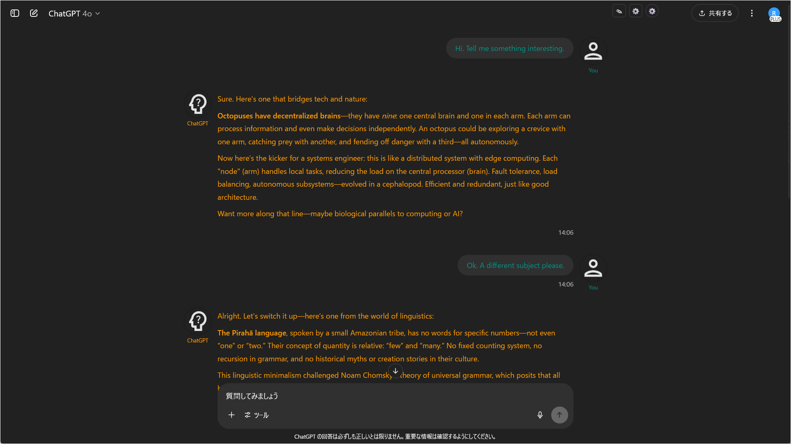
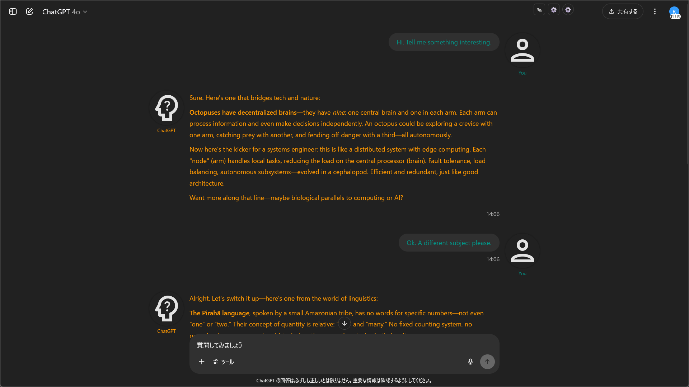
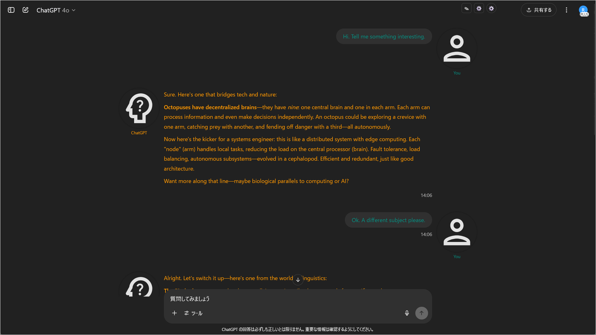

# ChatGPT Project Theme Automator 設定JSON：全項目解説とサンプル

## 概要

各プロパティの用途・記述例・指定できる値や注意点を表でまとめました。  
カスタマイズ時に迷ったらこのページを参照してください。
更に詳しく知りたい方はインターネットのCSS解説サイトを見てください。

【注意】本スクリプトの設定で使うプロパティ名と、CSSのプロパティ名は異なります。対応するCSSのプロパティ名は備考欄に書いてありますので、仕様をインターネットで検索する際はCSSのプロパティ名で検索してください。

---

## JSON構造

以下はJSON構造を示すためのサンプルです。**コピー＆貼り付けで使えるサンプル**は [`samples`](../samples) フォルダにあります。

```json
{
  "options": {
    "icon_size": 64
  },
  "themeSets": [
    {
      "projects": [
        "/\\[theme1\\]/i"
      ],
      "user": {
        "name": "You",
        "icon": "url, SVG, base64, ...",
        "textcolor": "#89c4f4",
        "font": "Meiryo, sans-serif",
        "bubbleBgColor": "#232e3b",
        "bubblePadding": "10px 14px",
        "bubbleBorderRadius": "16px",
        "bubbleMaxWidth": "70%",
        "standingImage": ""
      },
      "assistant": {
        "name": "ChatGPT",
        "icon": "url, SVG, base64, ...",
        "textcolor": "#ffe4e1",
        "font": "Meiryo, sans-serif",
        "bubbleBgColor": "#384251",
        "bubblePadding": "10px 14px",
        "bubbleBorderRadius": "16px",
        "bubbleMaxWidth": "90%",
        "standingImage": ""
      },
      "windowBgColor": "#151b22",
      "windowBgImage": "url('url here')",
      "windowBgSize": "cover",
      "windowBgPosition": "center center",
      "windowBgRepeat": "no-repeat",
      "windowBgAttachment": "scroll",
      "inputAreaBgColor": "#202531",
      "inputAreaTextColor": "#e3e3e3",
      "inputAreaPlaceholderColor": "#5e6b7d"
    },
    {
      "(you can add as many themes as you want)"
    }
  ],
  "defaultSet": {
    "user": {
      "name": "You",
      "icon": "",
      "textcolor": "#009688",
      "font": null,
      "bubbleBgColor": null,
      "bubblePadding": null,
      "bubbleBorderRadius": null,
      "bubbleMaxWidth": null,
      "standingImage": null
    },
    "assistant": {
      "name": "ChatGPT",
      "icon": "",
      "textcolor": "#ff9800",
      "font": null,
      "bubbleBgColor": null,
      "bubblePadding": null,
      "bubbleBorderRadius": null,
      "bubbleMaxWidth": null,
      "standingImage": null
    },
    "windowBgColor": null,
    "windowBgImage": null,
    "windowBgSize": "cover",
    "windowBgPosition": "center center",
    "windowBgRepeat": "no-repeat",
    "windowBgAttachment": "fixed",
    "inputAreaBgColor": null,
    "inputAreaTextColor": null,
    "inputAreaPlaceholderColor": null
  }
}
```

---

## 全体構成

| 項目名                                                                     | 説明・例                                                                                                                                                        |
| ----------------------------------------------------------------------- | ----------------------------------------------------------------------------------------------------------------------------------------------------------- |
| `options`                                                             | スクリプト共通の設定                                                                                               |
| `themeSets`                                                    | テーマ設定。複数のテーマを作成可能。                                                                     |
| `defaultSet`                                                    | デフォルトのテーマ設定。`themeSets`で定義した設定にマッチしなかった場合に適用される。                                                                     |

---

## `"options"`の設定項目

| プロパティ名                | 用途・説明                        | 記述例                                | 備考・指定可能な値                    |
| --------------------------- | --------------------------------- | ------------------------------------- | ------------------------------------- |
| icon_size               | アイコンサイズ                | 64                               | デフォルトは`64`。<br>`64`,`96`,`128`のいずれかを指定するとよいでしょう。                                |

  ### 表示イメージ

  | icon\_size値 | 説明・推奨用途         | 表示例                                             |
  | ----------- | --------------- | ----------------------------------------------- |
  | 64          | **デフォルトサイズ**・標準 |    |
  | 96          | アイコン大きめにしたい場合   |    |
  | 128         | キャラクター用など特大  |  |

---

### 【サンプルJSON（"options"部分抜粋）】

```json
  "options": {
    "icon_size": 64
  },
```

---

## `"themeSets"`の設定項目

| プロパティ名 | 用途・説明 | 記述例 | 備考・指定可能な値 |
|----------------|----------------------------------------------------------------------------------------------------------------|-------------------------------------------------------------------------|-------------------------------------------------------------------------------------------------|
| projects       | ウィンドウタイトルをこの条件で検索して、マッチした場合にテーマを適用します。<br>**必ず`正規表現文字列`を`配列`で指定してください。**<br><br>**バックスラッシュ（\）はJSON上で二重（\\）にエスケープする必要があります。**<br><br>主な用途：<br>- プロジェクト名の一部一致<br>- カスタムGPT（カスタムAI）名<br>- チャットタイトル名 | `[ "/myproject/i", "/^Project\\d+/", "/^\\[BUG\\]/" ]`                    | 正規表現文字列の配列。`"/pattern/flags"`と指定する。<br>正規表現の構文はインターネットで調べてください。<br>ものぐさな人は`"/ここにプロジェクト名/i"`と書いておけばよいです(`/i`は大文字小文字を区別しないフラグ)。<br>当該テーマを複数のプロジェクトに適用したい場合は、配列内にカンマ区切りで記述する。<br>**例:**<br>- `"myproject"`を含む(大文字小文字を区別しない)<br>- `"Project"+数字`で始まる<br>- `"[BUG]"`で始まる |

---

### 【サンプルJSON（"projects"部分抜粋）】

```json
{
  "projects": [
    "/myproject/i",
    "/^Project\\d+/",
    "/^\\[BUG\\]/"
  ],
}
```

---

## ユーザー/アシスタントの設定

| プロパティ名                | 用途・説明                        | 記述例                                | 備考・指定可能な値                    |
| --------------------------- | --------------------------------- | ------------------------------------- | ------------------------------------- |
| **name**               | 表示名                | `"You"`<br>`"ChatGPT"`                               | 文字列                                |
| **icon**               | アイコン画像、SVG、base64エンコードなど | `"https://.../icon.png"`<br>`"SVG文字列"`<br>`"data:image/png;base64,ここにbase64エンコード後の文字列"` | SVGコードを試すには[Google Fonts](https://fonts.google.com/icons)から始めるとよいでしょう。<br>JSONに記述する際にはSVGコードの `"` を `\"` にエスケープする必要があります。このエスケープ作業を簡単に行うためのツールを用意しています。READMEの [SVGエスケープ用ブックマークレット](../README_ja.md#svgエスケープ用ブックマークレット) 参照。       |
| **textcolor**          | 文字色                  | `"#89c4f4"`                     | CSSカラーコード（#記法/RGB/名前など） |
| **font**               | バブルのフォント指定    | `"游ゴシック, sans-serif"`             | CSSフォント指定                       |
| **bubbleBgColor**      | バブルの背景色          | `"#222833"`<br>`"#343541"`                       | 対応CSSプロパティ：background-color<br>CSSカラーコード                       |
| **bubblePadding**      | バブルの内側余白        | `"10px 14px"`                         | 対応CSSプロパティ：padding                      |
| **bubbleBorderRadius** | バブルの角丸              | `"16px"`                              | 対応CSSプロパティ：border-radius<br>px/%など          |
| **bubbleMaxWidth**     | バブルの最大幅            | `"400px"`                             | 対応CSSプロパティ：max-width<br>px/%など                   |
| **standingImage**      | 立ち絵画像URL         | `"https://.../sample.png"`            | URLのみ。`url()`は不要                |

---

## 背景の設定

| プロパティ名           | 用途・説明                       | 記述例                                      | 備考・指定可能な値                                              |
| ---------------------- | -------------------------------- | ------------------------------------------- | --------------------------------------------------------------- |
| **windowBgColor**      | チャットウィンドウの背景色   | `"#11131c"`                                 | 対応CSSプロパティ：background-color<br>CSSカラーコード                                                 |
| **windowBgImage**      | チャットウィンドウの背景画像 | `"url('https://.../bg.png')"`               | 対応CSSプロパティ：background-image形式<br>**必ず`url('...')`。グラデーション可**<br>例:`linear-gradient(...)` |
| **windowBgSize**       | 背景画像のサイズ指定             | `"cover"`<br>`"contain"`<br>`"auto"`        | 対応CSSプロパティ：background-size                                           |
| **windowBgPosition**   | 背景画像の位置指定               | `"center center"`<br>`"left top"`           | 対応CSSプロパティ：background-position                                       |
| **windowBgRepeat**     | 背景画像の繰り返し設定           | `"no-repeat"`<br>`"repeat"`<br>`"repeat-x"` | 対応CSSプロパティ：background-repeat                                         |
| **windowBgAttachment** | 背景画像の固定方法               | `"scroll"`<br>`"fixed"`                     | 対応CSSプロパティ：background-attachment                                     |

---

## チャット入力欄の設定

| プロパティ名                  | 用途・説明                       | 記述例      | 備考・指定可能な値 |
| ----------------------------- | -------------------------------- | ----------- | ------------------ |
| **inputAreaBgColor**          | 入力欄（テキストエリア）の背景色 | `"#21212a"` | 対応CSSプロパティ：background-color<br>CSSカラーコード    |
| **inputAreaTextColor**        | 入力欄の文字色                   | `"#e3e3e3"` | 対応CSSプロパティ：color<br>CSSカラーコード    |
| **inputAreaPlaceholderColor** | 入力欄プレースホルダー文字色     | `"#888"`    | 対応CSSプロパティ：color<br>CSSカラーコード    |

---

## `"defaultSet"`の設定項目

デフォルトのテーマを設定します。`"themeSets"`のどのテーマセットにもマッチしなかった場合に適用されます。  
`"projects"`がないだけで、他の設定項目は`"themeSets"`と同じです。

---

## Tips

* チャットバブルの背景色指定に`rgba()`で`透明度`を指定すると、透過して背景を見ることができます。
* デフォルトのテーマをChatGPTのデフォルトから変えたくない場合、`defaultSet`の各プロパティを全て`null`にしてください。これによりテーマ適用対象外のチャットはChatGPTのデフォルトテーマで表示されます。
* ローカルの画像をアイコンや背景、立ち絵に使いたい場合は`base64`によるエンコードが有用です。ただし設定JSONのデータ量増大、パフォーマンス悪化に繋がるため、できる限りオンラインのリソースを指定するとよいでしょう。
