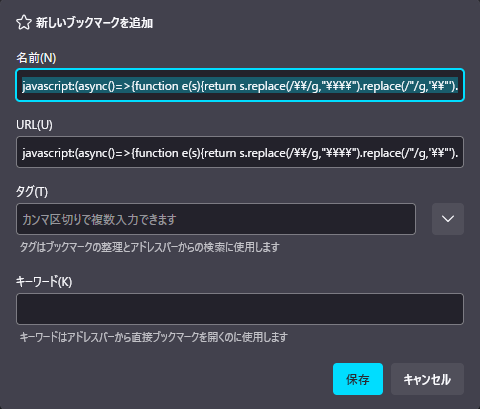
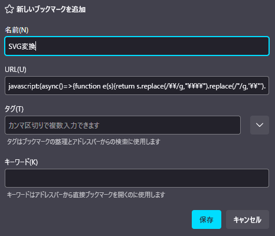
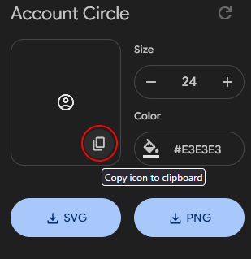

# ChatGPT Project Theme Automator 設定JSON：全項目解説

## 概要

【**重要**】 **v1.2.0から設定の構造が大きく変わりました。**
* プロパティ名が、`"bubbleBackgroundColor"` のような **キャメルケース (camelCase) に統一**されました。
* `"projects"` は `"metadata"` オブジェクト内の `"matchPatterns"` に変更されました。
* 新機能（UI改善、チャット幅指定など）のための `"features"` や `"options"` が追加されました。
* 背景や入力欄の設定は `"window"`, `"inputArea"` オブジェクトにまとめられました。

**古いバージョンの設定ファイルは互換性がないため、以下のツールを使って設定ファイルを移行してください。**  
[設定ファイル変換ツール](https://p65536.github.io/ChatGPT-Project-Theme-Automator/tools/convert_json.html)

---

各プロパティの用途・記述例・指定できる値や注意点を表でまとめました。  
カスタマイズ時に迷ったらこのページを参照してください。

【注意】本スクリプトの設定で使うプロパティ名と、CSSのプロパティ名は異なります。対応するCSSのプロパティ名は備考欄に書いてありますので、仕様をインターネットで検索する際はCSSのプロパティ名で検索してください。

---

## JSON構造

以下はJSON構造を示すためのサンプルです。**コピー＆貼り付けやインポートして使えるサンプル**は [`samples`](../samples) フォルダにあります。

```json
{
  "options": {
    "icon_size": 64,
    "chat_content_max_width": "800px"
  },
  "features": {
    "collapsible_button": {
      "enabled": true,
      "display_threshold_multiplier": 2
    },
    "scroll_to_top_button": {
      "enabled": true,
      "display_threshold_multiplier": 2
    },
    "sequential_nav_buttons": {
      "enabled": true
    }
  },
  "themeSets": [
    {
      "metadata": {
        "id": "cpta-theme-example-1",
        "name": "My Project Theme 1",
        "matchPatterns": [
          "/\\[theme1\\]/i",
          "/My Project/i"
        ]
      },
      "user": {
        "name": "You",
        "icon": "url, SVG, base64, ...",
        "textColor": "#89c4f4",
        "font": "Meiryo, sans-serif",
        "bubbleBackgroundColor": "#232e3b",
        "bubblePadding": "10px 14px",
        "bubbleBorderRadius": "16px",
        "bubbleMaxWidth": "70%",
        "standingImageUrl": ""
      },
      "assistant": {
        "name": "Assistant",
        "icon": "url, SVG, base64, ...",
        "textColor": "#ffe4e1",
        "font": "Meiryo, sans-serif",
        "bubbleBackgroundColor": "#384251",
        "bubblePadding": "10px 14px",
        "bubbleBorderRadius": "16px",
        "bubbleMaxWidth": "90%",
        "standingImageUrl": ""
      },
      "window": {
        "backgroundColor": "#151b22",
        "backgroundImageUrl": "url('url here')",
        "backgroundSize": "cover",
        "backgroundPosition": "center center",
        "backgroundRepeat": "no-repeat",
        "backgroundAttachment": "scroll"
      },
      "inputArea": {
        "backgroundColor": "#202531",
        "textColor": "#e3e3e3",
        "placeholderColor": "#5e6b7d"
      }
    },
    {
      "metadata": {
        "id": "cpta-theme-example-2",
        "name": "(ここにテーマ名)",
        "matchPatterns": [
          "(ここに正規表現)"
        ]
      },
      "..." : "(テーマ設定はいくつでも追加できます)"
    }
  ],
  "defaultSet": {
    "user": {
      "name": "You",
      "icon": "",
      "textColor": null,
      "font": null,
      "bubbleBackgroundColor": null,
      "bubblePadding": null,
      "bubbleBorderRadius": null,
      "bubbleMaxWidth": null,
      "standingImageUrl": null
    },
    "assistant": {
      "name": "ChatGPT",
      "icon": "",
      "textColor": null,
      "font": null,
      "bubbleBackgroundColor": null,
      "bubblePadding": null,
      "bubbleBorderRadius": null,
      "bubbleMaxWidth": null,
      "standingImageUrl": null
    },
    "window": {
      "backgroundColor": null,
      "backgroundImageUrl": null,
      "backgroundSize": "cover",
      "backgroundPosition": "center center",
      "backgroundRepeat": "no-repeat",
      "backgroundAttachment": "fixed"
    },
    "inputArea": {
      "backgroundColor": null,
      "textColor": null,
      "placeholderColor": null
    }
  }
}
````

-----

## 全体構成

| 項目名 | 説明・例 |
| --- | --- |
| `options` | スクリプトの動作や表示に関する共通設定。 |
| `features` | UI改善機能の有効/無効を切り替える設定。 |
| `themeSets` | テーマ設定の配列。複数のテーマを作成可能。 |
| `defaultSet` | デフォルトのテーマ設定。`themeSets`で定義したどのテーマにもマッチしなかった場合に適用される。 |

-----

## `"options"`の設定項目

| プロパティ名 | 用途・説明 | 記述例 | 備考・指定可能な値 |
| --- | --- | --- | --- |
| `icon_size` | アイコンサイズ | `64` | 数値。デフォルトは`64`。<br>表示のバランスから`64`,`96`,`128`のいずれかを推奨。 |
| `chat_content_max_width` | チャット内容部分の最大幅 | `'800px'`<br>`'70vw'` | CSSの`max-width`で有効な値を文字列で指定。<br>空欄または`null`でChatGPTのデフォルト。 |

### 表示イメージ (`icon_size`)

| icon\_size値 | 説明・推奨用途         | 表示例                                             |
| ----------- | --------------- | ----------------------------------------------- |
| 64          | **デフォルトサイズ**・標準 |    |
| 96          | アイコン大きめにしたい場合   |    |
| 128         | キャラクター用など特大  |  |

-----

## `"features"`の設定項目

便利なUI改善機能のON/OFFや、動作の閾値などを設定します。

| プロパティ名 | 用途・説明 | 記述例 | 備考・指定可能な値 |
| --- | --- | --- | --- |
| `collapsible_button` | 長いメッセージを折りたたむボタンに関する設定。 | `{ "enabled": true, "display_threshold_multiplier": 2 }` | `enabled`: `true`/`false`<br>`display_threshold_multiplier`: ボタンを表示する高さの閾値（アイコンサイズとの倍率）。`2`ならアイコンの2倍より高いメッセージに表示。`0`で常に表示。 |
| `scroll_to_top_button` | メッセージの先頭（ターンの先頭）へスクロールするボタンに関する設定。 | `{ "enabled": true, "display_threshold_multiplier": 2 }` | `enabled`: `true`/`false`<br>`display_threshold_multiplier`: ボタンを表示する高さの閾値（アイコンサイズとの倍率）。複数パートに分かれた長い応答でも表示されます。`0`で常に表示。 |
| `sequential_nav_buttons` | 同じ作者（ユーザーまたはアシスタント）の次/前のメッセージへジャンプするボタンに関する設定。 | `{ "enabled": true }` | `enabled`: `true`/`false` |

-----

## `"themeSets"`の設定項目

テーマはオブジェクトの配列として`themeSets`に複数定義できます。

### `"metadata"` (テーマ情報)

各テーマオブジェクトの最初に、テーマの情報を定義する`metadata`を記述します。

| プロパティ名 | 用途・説明 | 記述例 | 備考・指定可能な値 |
| --- | --- | --- | --- |
| `id` | テーマのユニークID | `"cpta-theme-12345"` | スクリプトが内部で管理するためのIDです。通常は編集する必要はありません。テーマエディタで新規作成すると自動で付与されます。 |
| `name` | テーマ名 | `"My Project Theme"` | テーマエディタの選択肢に表示される名前です。わかりやすい名前を付けてください。 |
| `matchPatterns` | テーマ適用条件 | `[ "/myproject/i", "/^Project\\\\d+/" ]` | **正規表現文字列の配列**で指定します。ウィンドウタイトルがこの条件にマッチした場合にテーマが適用されます。<br>**バックスラッシュ（\\）はJSON上で二重（\\）にエスケープする必要があります。**<br><br>**例:**<br>- `"myproject"`を含む(`/i`で大文字小文字を区別しない)<br>- `"Project"+数字`で始まる |

-----

### ユーザー/アシスタントの設定 (`"user"` / `"assistant"`)

| プロパティ名 | 用途・説明 | 記述例 | 備考・指定可能な値 |
| --- | --- | --- | --- |
| `name` | 表示名 | `"You"`, `"ChatGPT"` | 文字列 |
| `icon` | アイコン画像 | `"https://.../icon.png"`<br>`"<svg>..."` | URL、SVGコード、Base64など。<br>JSON直接編集時は、SVGコードの `"` は `\"` にエスケープが必要です。[SVGエスケープ用ツール](#svgエスケープ用ツール) を利用すると簡単です。<br>GUI設定画面ではエスケープ不要です。 |
| `textColor` | 文字色 | `"#89c4f4"` | CSSカラーコード（\#記法/rgb()/名前など） |
| `font` | バブルのフォント指定 | `"游ゴシック", sans-serif` | CSSフォント指定 |
| `bubbleBackgroundColor` | バブルの背景色 | `"#222833"` | 対応CSSプロパティ: `background-color` |
| `bubblePadding` | バブルの内側余白 | `"10px 14px"` | 対応CSSプロパティ: `padding` |
| `bubbleBorderRadius` | バブルの角丸 | `"16px"` | 対応CSSプロパティ: `border-radius` |
| `bubbleMaxWidth` | バブルの最大幅 | `"70%"` | 対応CSSプロパティ: `max-width` |
| `standingImageUrl` | 立ち絵画像URL | `"https://.../sample.png"` | 対応CSSプロパティ: `background-image`形式。<br>単一URLの他、`linear-gradient`等との組み合わせも可能。 |

-----

### 背景の設定 (`"window"`)

| プロパティ名 | 用途・説明 | 記述例 | 備考・指定可能な値 |
| --- | --- | --- | --- |
| `backgroundColor` | チャットウィンドウの背景色 | `"#11131c"` | 対応CSSプロパティ: `background-color` |
| `backgroundImageUrl` | チャットウィンドウの背景画像 | `"https://.../bg.png"` | 対応CSSプロパティ: `background-image`形式。<br>単一URLの他、`linear-gradient`等との組み合わせも可能。 |
| `backgroundSize` | 背景画像のサイズ指定 | `"cover"`, `"contain"` | 対応CSSプロパティ: `background-size` |
| `backgroundPosition` | 背景画像の位置指定 | `"center center"` | 対応CSSプロパティ: `background-position` |
| `backgroundRepeat` | 背景画像の繰り返し設定 | `"no-repeat"`, `"repeat"` | 対応CSSプロパティ: `background-repeat` |
| `backgroundAttachment` | 背景画像の固定方法 | `"scroll"`, `"fixed"` | 対応CSSプロパティ: `background-attachment` |

-----

### チャット入力欄の設定 (`"inputArea"`)

| プロパティ名 | 用途・説明 | 記述例 | 備考・指定可能な値 |
| --- | --- | --- | --- |
| `backgroundColor` | 入力欄の背景色 | `"#21212a"` | 対応CSSプロパティ: `background-color` |
| `textColor` | 入力欄の文字色 | `"#e3e3e3"` | 対応CSSプロパティ: `color` |
| `placeholderColor` | 入力欄プレースホルダー文字色 | `"#888"` | 対応CSSプロパティ: `color` |

-----

## `"defaultSet"`の設定項目

デフォルトのテーマを設定します。`"themeSets"`のどのテーマにもマッチしなかった場合に適用されます。  
設定項目は`"themeSets"`の各テーマから`"metadata"`を除いたものと同じです。

-----

## Tips

  * チャットバブルの背景色指定に`rgb(R G B / A)`で`A:アルファ値`を指定すると、背景を透過させることができます。
  * デフォルトのテーマをChatGPT標準のものから変えたくない場合、`defaultSet`の各プロパティを全て`null`に設定してください。
  * ローカルの画像をアイコンや背景に使いたい場合は`base64`エンコードが有用ですが、設定JSONの肥大化やパフォーマンス低下を招く可能性があるため、オンラインのリソースを指定することを推奨します。

-----

## SVGエスケープ用ツール

アイコンにSVGコードを設定できますが、JSONに記述する際にはSVGコードの `"` を `\"` にエスケープする必要があります。  
手作業でエスケープするのは面倒くさいので、簡単に変換できるツールを2つ用意しました。好きな方を使ってください。  
  - **[Webツール(html)](https://p65536.github.io/ChatGPT-Project-Theme-Automator/tools/convert_svg.html)**  ... リンクを開いてください。使い方は見れば分かります。
  - **ブックマークレット** ... このまま読み進めてください。

ブックマークレットとは、ブックマークにJavaScriptのコードを登録し、そのコードを簡単に実行できるようにする機能です。  
以下の手順でブックマークに追加してください。

### 1. 以下のテキストを全て選択（トリプルクリック）して**ブックマークバーにドラッグ＆ドロップ**してください。

```js
javascript:(async()=>{function e(s){return s.replace(/\\/g,"\\\\").replace(/"/g,'\\"').replace(/\n/g,"");}try{const t=await navigator.clipboard.readText();if(!t.trim().startsWith("<svg")){alert("クリップボードにSVGコードがありません。");return;}const a=e(t);await navigator.clipboard.writeText(a);alert("SVGをエスケープしてクリップボードにコピーしました！icon項目に貼ってください。");}catch(r){alert("失敗: "+r.message);}})()
```

### 2. ブックマーク追加のダイアログが表示されます。**任意の名前**を付けて保存してください。例：`SVG変換`  

  #### ブックマーク登録画面（画像はFirefoxの場合）

  

  #### 任意の名前を付けて保存（画像はFirefoxの場合）

  

  #### ブックマークに登録された（画像はFirefoxの場合）

  

### 3. 使い方

 1. SVGを公開しているサイト（ここでは [Google Fonts](https://fonts.google.com/icons) を例にします）で任意のアイコンのSVGコードをコピー。

    

 2. 先に作成したブックマークレット **`SVG変換`** を実行（ブックマークをクリック）

    

 3. 変換後のSVGコードがクリップボードにコピーされる。

    

 4. クリップボードのテキストを設定ファイル(JSON)の `icon` 項目の `""`内に貼り付ける。

     ```json
     "icon": "ここに貼り付け"
     ```
